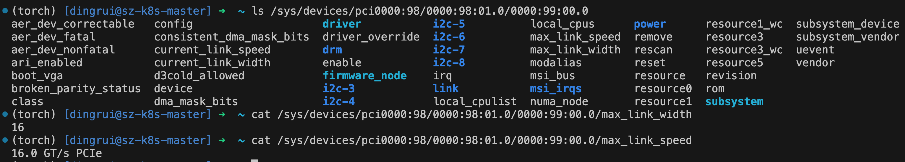

# NCCL Communicator Initialization #02: Bootstrap Network + Local Topology Detection

## Control Flow

- [ncclCommInitRank(ncclComm_t* newcomm, int nranks, ncclUniqueId commId, int myrank)](https://github.com/NVIDIA/nccl/blob/v2.25.1-1/src/init.cc#L1715) <- We are here!

This function aims to build the fully functional (1) bootstrap network, (2) data communication network, and (3) proxy network. Based on TCP, the bootstrap network is an out-of-band (OOB) connection that delivers control messages. The data communication network includes intra- and inter-node networks, which transmit data messages. The proxy network comprises the proxy thread per rank, which facilitates (1) building inter- and intra-node connections and (2) sending/receiving data over CollNet/RDMA/socket network. Since this function does a lot of work, we have to split this explanation of this function into a series of notes. Here is a list of these notes.

- [02-bootstrap-network](02-bootstrap-network.md)

- [03-XML-conversion](03-XML-conversion.md)

- [04-path-finding](04-path-finding)

- [05-channel-search](05-channel-search.md)

- [06-channel-connect](06-channel-connect.md)

- [07-transport-setup](07-transport-setup.md)

In this note, we focus on the first three things done by `ncclCommInitRank()`: (1) detecting the inter-node network (e.g., is it the RDMA network?), (2) building the bootstrap network, and (3) detecting local topology (local=intra-node) and representing it with an XML tree.

Before we move on, recall that [`ncclComm_t`](https://github.com/NVIDIA/nccl/blob/v2.25.1-1/src/nccl.h.in#L33) is a pointer to [`ncclComm`](https://github.com/NVIDIA/nccl/blob/v2.25.1-1/src/include/comm.h#L404-L614), which holds tons of context data (`sizeof(ncclComm)` is 501072!) needed by further communication. Initially, the argument of this function, `newcomm`, is just a null pointer.

## (Inter-node) Network Detection

**The body of `ncclCommInitRank()` is [`ncclCommInitRankDev()`](https://github.com/NVIDIA/nccl/blob/v2.25.1-1/src/init.cc#L1724). [`ncclCommInitRankDev()`](https://github.com/NVIDIA/nccl/blob/v2.25.1-1/src/init.cc#L1636) leverages [`ncclAsyncLaunch()`](https://github.com/NVIDIA/nccl/blob/v2.25.1-1/src/init.cc#L1698) to call [`ncclCommInitRankFunc()`](https://github.com/NVIDIA/nccl/blob/v2.25.1-1/src/init.cc#L1340) to do all the hard work.** This [`ncclAsyncLaunch()`](https://github.com/NVIDIA/nccl/blob/v2.25.1-1/src/group.cc#L27) function implements the NCCL [group call](https://docs.nvidia.com/deeplearning/nccl/user-guide/docs/usage/groups.html) semantic.

- Every time `ncclGroupStart()` is called, a global variable [`ncclGroupDepth`](https://github.com/NVIDIA/nccl/blob/v2.25.1-1/src/group.cc#L15) is [incremented](https://github.com/NVIDIA/nccl/blob/v2.25.1-1/src/include/group.h#L95); every time a `ncclGroupEnd()` is called, it is [decremented](https://github.com/NVIDIA/nccl/blob/v2.25.1-1/src/group.cc#L518).
- Based on the current `ncclGroupDepth`, [`nclAsyncLaunch()`](https://github.com/NVIDIA/nccl/blob/v2.25.1-1/src/group.cc#L27) chooses to execute the function [immediately](https://github.com/NVIDIA/nccl/blob/v2.25.1-1/src/group.cc#L37) or [asynchronously](https://github.com/NVIDIA/nccl/blob/v2.25.1-1/src/group.cc#L41-L65) (i.e., postpone until the outmost `ncclGroupEnd()`).

**[`ncclCommInitRankFunc()`](https://github.com/NVIDIA/nccl/blob/v2.25.1-1/src/init.cc#L1340) first initializes the communicator with [`commAlloc()`](https://github.com/NVIDIA/nccl/blob/v2.25.1-1/src/init.cc#L1394) (which detects the network), then uses [`bootstrapInit()`](https://github.com/NVIDIA/nccl/blob/v2.25.1-1/src/init.cc#L1402) to establish the bootstrap network, and finally calls [`initTransportsRank()`](https://github.com/NVIDIA/nccl/blob/v2.25.1-1/src/init.cc#L1407) to do the rest of the job (explained in this and subsequent notes).**

- One job of [`commAlloc()`](https://github.com/NVIDIA/nccl/blob/v2.25.1-1/src/init.cc#L329) is to initialize the data communication network using [`ncclNetInit()`](https://github.com/NVIDIA/nccl/blob/v2.25.1-1/src/net.cc#L907) and record the chosen network in `comm->ncclNet`, which is a pointer to `ncclNet_t`. [`ncclNet_t`](https://github.com/NVIDIA/nccl/blob/v2.25.1-1/src/include/nccl_net.h#L60-L118) is a common abstraction of the network. It is a collection of function signatures. Any network that implements the specified functions, e.g., `init`, `send`, and `recv`, can be assigned to `ncclNet_t`. Different networks like [socket](https://github.com/NVIDIA/nccl/blob/v2.25.1-1/src/transport/net_socket.cc#L620-L641) and [IB](https://github.com/NVIDIA/nccl/blob/v2.25.1-1/src/transport/net_ib.cc#L2344-L2365) implement their own functions and have a dedicated `ncclNet_t` object. Here, initialization means checking which communication network is available.

  - The default [checking order](https://github.com/NVIDIA/nccl/blob/v2.25.1-1/src/net.cc#L619) is first a user-specified network plugin, then the RDMA network, and lastly socket network. Once a network is available, it will [skip](https://github.com/NVIDIA/nccl/blob/v2.25.1-1/src/net.cc#L933) the rest of the networks. When checking the RDMA network, the control flow goes to [`ncclIbInit()`](https://github.com/NVIDIA/nccl/blob/v2.25.1-1/src/transport/net_ib.cc#L551). It tries loading `libibverbs.so` via [`wrap_ibv_symbols()`](https://github.com/NVIDIA/nccl/blob/v2.25.1-1/src/transport/net_ib.cc#L555).
  - Now, we assume the RDMA network. It uses [`warp_ibv_get_device_list()`](https://github.com/NVIDIA/nccl/blob/v2.25.1-1/src/transport/net_ib.cc#L583) to get the RDMA device lists, [`wrap_ibv_open_device()`](https://github.com/NVIDIA/nccl/blob/v2.25.1-1/src/transport/net_ib.cc#L587) to open the device, and [`wrap_ibv_query_device()`](https://github.com/NVIDIA/nccl/blob/v2.25.1-1/src/transport/net_ib.cc#L594) to fetch device attributes (e.g., #QPs, #Ports). Since a device can have multiple physical ports, it [iterates](https://github.com/NVIDIA/nccl/blob/v2.25.1-1/src/transport/net_ib.cc#L599) over all ports to obtain per-port info (e.g., RoCE/IB, PCI), which is saved in a global variable [`ncclIbDevs`](https://github.com/NVIDIA/nccl/blob/v2.25.1-1/src/transport/net_ib.cc#L84). Similarly to the filter `${NCCL_SOCKET_IFNAME}` when selecting the bootstrap interface, a filter based on `${NCCL_IB_HCA}` will be [applied](https://github.com/NVIDIA/nccl/blob/v2.25.1-1/src/transport/net_ib.cc#L610) here. Moreover, `${NCCL_IB_ADAPTIVE_ROUTING}` will [control](https://github.com/NVIDIA/nccl/blob/v2.25.1-1/src/transport/net_ib.cc#L634) whether to turn on adaptive routing, a hardware functionality built into the InfiniBand network.

  If the RDMA network is chosen, you can see the following line in the NCCL INFO log.

  ```
  sz-k8s-master:2548:2607 [0] NCCL INFO NET/IB : Using [0]mlx5_0:1/RoCE [1]mlx5_1:1/RoCE [RO]; OOB ens255f0np0:10.10.10.108<0>
  ```

  > **Note.** *IB* stands for **InfiniBand**, a lossless RDMA fabric. *RoCE* (*RDMA over Converged Ethernet*) offers the same RDMA semantics but encapsulates the packets in Ethernet (RoCE v1) or UDP/IP (RoCE v2). Because Ethernet and InfiniBand are distinct, incompatible layer‑2 protocols, an InfiniBand link needs dedicated HCAs and switches, whereas RoCE runs on ordinary Ethernet gear configured for lossless operation (PFC/ECN).
  >
  > Despite the different link layers, both transports expose the identical **RDMA Verbs API** (`ibv_*` functions).  That API lives in the userspace library `libibverbs.so`. So, a program written against IB Verbs can usually run unchanged (or with insignificant changes) on either InfiniBand or RoCE hardware.

## Bootstrap Network Establishment

Let's move on to [`bootstrapInit()`](https://github.com/NVIDIA/nccl/blob/v2.25.1-1/src/bootstrap.cc#L619), which first creates two listening sockets on the bootstrap network: one for the ring neighbor to [contact](https://github.com/NVIDIA/nccl/blob/v2.25.1-1/src/bootstrap.cc#L659) and another for the root to [contact](https://github.com/NVIDIA/nccl/blob/v2.25.1-1/src/bootstrap.cc#L663). Addresses of both sockets are recorded in `struct extInfo`. It [staggers](https://github.com/NVIDIA/nccl/blob/v2.25.1-1/src/bootstrap.cc#L666-L679) connection times to prevent several ranks from connecting to the root's bootstrap socket simultaneously (i.e., sleeping for some time based on my rank).

1. It first [sends](https://github.com/NVIDIA/nccl/blob/v2.25.1-1/src/bootstrap.cc#L687) to root its `struct extInfo`. The root's socket address comes from the ID. Upon receiving this handle, the root will check if the information matches.

2. Next, it [receives](https://github.com/NVIDIA/nccl/blob/v2.25.1-1/src/bootstrap.cc#L702) the next rank's socket address in the bootstrap ring (member name in `struct extInfo`: `connectInfo`; name in the program: `nextPeer`) from the root. This socket (waiting for the root to connect) is immediately closed.

3. It builds the bootstrap ring network by [connecting](https://github.com/NVIDIA/nccl/blob/v2.25.1-1/src/bootstrap.cc#L551) to the next peer's `connectInfo` and [accepting](https://github.com/NVIDIA/nccl/blob/v2.25.1-1/src/bootstrap.cc#L553) the previous rank's connection. The resulting sockets are [recorded](https://github.com/NVIDIA/nccl/blob/v2.25.1-1/src/bootstrap.cc#L713) in `state->socket.send` and `state->socket.recv`, respectively.

4. Then it opens two more listening sockets: one for the **proxy thread** (recorded in [`state->peerProxyAddresses[]`](https://github.com/NVIDIA/nccl/blob/v2.25.1-1/src/bootstrap.cc#L720), and another for **P2P communication** (recorded in [`state->peerP2pAddresses[]`](https://github.com/NVIDIA/nccl/blob/v2.25.1-1/src/bootstrap.cc#L729)). We will call them the **proxy socket** and **peer socket**, respectively.

5. It invokes [`bootstrapAllGather()`](https://github.com/NVIDIA/nccl/blob/v2.25.1-1/src/bootstrap.cc#L582) to let each peer know others' proxy sockets and peer sockets (i.e., P2P communication sockets). The underlying algorithm is Ring All-Gather, implemented in [`socketRingAllGather()`](https://github.com/NVIDIA/nccl/blob/v2.25.1-1/src/bootstrap.cc#L1010). For $N$ ranks, we need a [for loop](https://github.com/NVIDIA/nccl/blob/v2.25.1-1/src/bootstrap.cc#L1019-L1029) of length $(N-1)$. In round $i$, rank $r$ send $(r-i)\pmod{N}$-th element to the next peer (via `state->socket.send`), and receives $(r-1-i)\pmod N$-th element from the previous peer (via `state->socket.recv`). Here, the element has the type [`struct bootstrapRingData`](https://github.com/NVIDIA/nccl/blob/v2.25.1-1/src/bootstrap.cc#L563), including the peer socket's and proxy socket's addresses. When done, each peer knows the proxy socket and peer socket of all peers. Please note that communication here occurs on the out-of-band communication ring, which typically uses the TCP/IP network stack.

   ```mermaid
   sequenceDiagram
   	autonumber
   	participant P as Prev Rank
   	participant R as Rank
   	participant N as Next Rank
   	participant Rt as Root
   	R->>Rt: This is my info
   	note over R: Address: ncclUniqueID
   	Rt->>R: This is your next rank's socket address in the bootstrap ring
   	note over Rt: Address: listenRootAddress
   	R->>N: Connected to next peer's socket in the bootstrap ring
   	P->>R: Accept prev peer's connection
   	R->>R: Open two listen sockets: proxy socket and peer socket
   	P->>N: Ring All-Gather for (N-1) rounds
   ```

If NCCL is compiled with trace enabled (`TRACE=1` when `make`), the following line will appear in the log.

```
sz-k8s-master:2548:2607 [0] NCCL INFO Bootstrap timings total 0.092076 (create 0.000031, send 0.000116, recv 0.000223, ring 0.047635, delay 0.000000)
```

## Local Topology Detection

The control flow now goes to [`initTransportsRank()`](https://github.com/NVIDIA/nccl/blob/v2.25.1-1/src/init.cc#L659), which detects intra-node topology, searches for channels, connects channels on different nodes, and builds the actual connection. During its execution, it performs two Ring All-Gathers on the bootstrap network. The first All-Gather exchanges [`ncclPeerInfo`](https://github.com/NVIDIA/nccl/blob/v2.25.1-1/src/include/transport.h#L36), which holds information like the PID (Process ID) and host machine of the peer (i.e., a rank) and whether it supports GDR. The procedure is to fill in the peer's information via [`fillInfo()`](https://github.com/NVIDIA/nccl/blob/v2.25.1-1/src/init.cc#L706) and use [`bootstrapAllGather()`](https://github.com/NVIDIA/nccl/blob/v2.25.1-1/src/init.cc#L707) to Ring All-Gather every peer's info. The second All-Gather occurs after each peer knows its local channels.

For now, we focus on the first All-Gather and the local topology detection following it.

- [`fillInfo()`](https://github.com/NVIDIA/nccl/blob/v2.25.1-1/src/init.cc#L539) fills in rank, PCIe bus ID, device number of `/dev/shm`, GDR support, etc. It uses [`ncclGpuGdrSupport()`](https://github.com/NVIDIA/nccl/blob/v2.25.1-1/src/init.cc#L557) to check GDR support. For CUDA 11.3 or later, it simply queries the [`cudaDevAttrGPUDirectRDMASupported`](https://docs.nvidia.com/cuda/cuda-runtime-api/group__CUDART__TYPES.html#group__CUDART__TYPES_1g49e2f8c2c0bd6fe264f2fc970912e5cd:~:text=cudaDevAttrGPUDirectRDMASupported) attribute using [`cudaDeviceGetAttribute()`](https://github.com/NVIDIA/nccl/blob/v2.25.1-1/src/net.cc#L958).

  - For older CUDA versions, `ncclGpuGdrSupport()` [iterates](https://github.com/NVIDIA/nccl/blob/v2.25.1-1/src/net.cc#L970-L1001) over all available NICs, using `comm->ncclNet`'s [`getProperties()`](https://github.com/NVIDIA/nccl/blob/v2.25.1-1/src/net.cc#L973) method to get the properties. Recall that `comm->ncclNet` is already initialized to the IB network, so it actually calls [`ncclIbGetProperties()`](https://github.com/NVIDIA/nccl/blob/v2.25.1-1/src/transport/net_ib.cc#L781). Also, recall that device properties are stored in the global [`ncclIbDevs`](https://github.com/NVIDIA/nccl/blob/v2.25.1-1/src/transport/net_ib.cc#L84), including device name, speed, PCI path, and NIC's GUID. To check if GDR is supported, [`ncclIbGdrSupport()`](https://github.com/NVIDIA/nccl/blob/v2.25.1-1/src/transport/net_ib.cc#L762) checks if  `/sys/module/nvidia_peermem/version` is loaded. Here, [`nvidia_peermem`](https://github.com/Mellanox/nv_peer_memory) is a kernel module that enables GDR for Mellanox IB HCAs on Nvidia GPUs. it also checks if `/sys/kernel/mm/memory_peers/nv_mem/version` or `/sys/kernel/mm/memory_peers/nv_mem_nc/version` is loaded, but these two are older names for the same driver functionality.
  - `fillInfo()` also [checks](https://github.com/NVIDIA/nccl/blob/v2.25.1-1/src/init.cc#L561-L581) MNNVL support (multi-node NV-Link).

- After the first AllGather, each peer will [check](https://github.com/NVIDIA/nccl/blob/v2.25.1-1/src/init.cc#L711-L716) whether all of them are using the same NCCL version, disable [`cuMemSupport`](https://github.com/NVIDIA/nccl/blob/v2.25.1-1/src/init.cc#L718) if one of them does not support it (CUDA `cuMem` APIs manage virtual memory and are required by MNNVL), and [ensure]() they all use different GPUs. It will also check which ranks are in the same process and record it in `intraXXX` in `comm`.

  - NCCL frequently uses `busId` in tasks like telling co-located ranks and identifying IB NICs. Please note that `busId` contains not just the PCI bus number but also the device and function number (BDF=bus+device+function). After system booting, they are exposed to users via `sysfs`. NCCL reads related `/sys` files to fetch the required knowledge (e.g., the aforementioned `/sys/module/nvidia_peermem/version`).

- [`ncclTopoGetSystem()`](https://github.com/NVIDIA/nccl/blob/v2.25.1-1/src/init.cc#L796) builds the current rank's PCI tree (intra-node network topology) in two major steps: (1) constructing it in the XML format, whose tree structure well represents the system paths of the involved hardware; (2) Translating XML into `ncclTopoNode`, which facilitates path searching and channel searching later on.

  - [`ncclXmlNode`](https://github.com/NVIDIA/nccl/blob/v2.25.1-1/src/graph/xml.h#L26) represents a single node in the PCI tree. It has attributes (in the key-value format), a name, one parent, and many children. [`ncclXml`](https://github.com/NVIDIA/nccl/blob/v2.25.1-1/src/graph/xml.h#L39) holds the root of the XML tree, which is named ["system"](https://github.com/NVIDIA/nccl/blob/v2.25.1-1/src/graph/topo.cc#L1265) and has an attribute `version=NCCL_TOPO_XML_VERSION`. It then detects the GPU managed by the current process via [`ncclTopoFillGpu()`](https://github.com/NVIDIA/nccl/blob/v2.25.1-1/src/graph/topo.cc#L1275). It then detects NICs via [`ncclTopoProcessNet()`](https://github.com/NVIDIA/nccl/blob/v2.25.1-1/src/graph/topo.cc#L1295). After that, an intra-node Ring AllGather (implemented in [`bootstrapIntraNodeAllGather()`](https://github.com/NVIDIA/nccl/blob/v2.25.1-1/src/graph/topo.cc#L1326)) is used to collect XML trees on the same root. Each rank then fuses the XML trees with all peers' running on the same host (since it may contain many GPUs, and each peer only detects the one it owns).

    - [`ncclTopoFillGpu()`](https://github.com/NVIDIA/nccl/blob/v2.25.1-1/src/graph/xml.cc#L874) first calls [`ncclGetPciNode()`](https://github.com/NVIDIA/nccl/blob/v2.25.1-1/src/graph/xml.cc#L874) to add a "pci" node with an attribute `busid`. It then calls [`ncclTopoGetXmlFromSys()`](https://github.com/NVIDIA/nccl/blob/v2.25.1-1/src/graph/xml.cc#L878) to get the path from GPU to CPU, and sets the corresponding attributes along the way. The path-finding logic is implemented in [`getPciPath()`](https://github.com/NVIDIA/nccl/blob/v2.25.1-1/src/graph/xml.cc#L400), which uses the C function `realpath()` to convert the `busId` into the absolute path of the current GPU. It then goes up the path (i.e., [counting `/`](https://github.com/NVIDIA/nccl/blob/v2.25.1-1/src/graph/xml.cc#L651)) until the root complex is found. It finally calls [`ncclTopoGetXmlFromGpu()`](https://github.com/NVIDIA/nccl/blob/v2.25.1-1/src/graph/xml.cc#L881) to get Nvidia GPU's specific properties, like NVLink and GPU architecture. We use our test machine's GPU 0 as an example to illustrate the process.

      1. GPU 0's busId is `0000:99:00.0`, and `getPciPath()` will return `/sys/devices/pci0000:98/0000:98:01.0/0000:99:00.0`. The test machine's topology is depicted as follows. `pci0000:98` is a CPU root complex starting a PCI hierarchy with domain `0000` and bus number `98`. `0000:98:01.0` is a PCI bridge whose `bus=98, device=1, function=0`. It creates the next bus with `bus=99`, and GPU 0 is attached to this bus. The device attributes are presented to programs like regular files.

         

         

      2. Starting from the PCI node (GPU 0), `ncclTopoGetXmlFromSys()` adds the PCI switch until it sees a root complex. It counts the `/` (slash) in the path. Since a PCI switch has an upstream port and a downstream port, contributing 2 slashes in the path, `ncclTopoGetXmlFromSys()` adds a new "pci" XML node whenever `slashCount` [accumulates](https://github.com/NVIDIA/nccl/blob/v2.25.1-1/src/graph/xml.cc#L651) to 2. It only records the address of the upstream port to represent the PCI switch. When a CPU is [met](https://github.com/NVIDIA/nccl/blob/v2.25.1-1/src/graph/xml.cc#L649), a "cpu" node is inserted below the "system" node, with attributes like arch, affinity, etc. using [`ncclTopoGetXmlFromCpu()`](https://github.com/NVIDIA/nccl/blob/v2.25.1-1/src/graph/xml.cc#L718). We omit the details of this function. 

      3. [`ncclTopoGetXmlFromGpu()`](https://github.com/NVIDIA/nccl/blob/v2.25.1-1/src/graph/xml.cc#L724) iterates over all possible NVLink ports to detect NVLink. It uses [`ncclNvmlDeviceGetNvLinkCapability()`](https://github.com/NVIDIA/nccl/blob/v2.25.1-1/src/graph/xml.cc#L769) to get the NVLink info. If the NVLink is active, it [asks](https://github.com/NVIDIA/nccl/blob/v2.25.1-1/src/graph/xml.cc#L790) NVML (Nvidia Management Library) for the remote device’s PCI info at the other end of the NVLink (stored in the [`target`](https://github.com/NVIDIA/nccl/blob/v2.25.1-1/src/graph/xml.cc#L801) attribute), and counts the number of NVLinks between the two ends (stored in the [`count`](https://github.com/NVIDIA/nccl/blob/v2.25.1-1/src/graph/xml.cc#L805) attribute).

      After this process, the XML tree on GPU 0 looks like this (we only highlight some attributes besides the node's name).

      ```mermaid
      flowchart LR
      	system-->cpu(cpu,numaid=1)
      	cpu-->pci(pci,busid=0000:99:00.0)
      	pci-->gpu(gpu,gdr=1)
      	gpu-->nvlink(nvlink,target=0000:bd:00.0,count=4)
      ```

    - [`ncclTopoProcessNet()`](https://github.com/NVIDIA/nccl/blob/v2.25.1-1/src/graph/topo.cc#L1198) enumerates physical NICs via [`ncclTopoPopulateNICs`](https://github.com/NVIDIA/nccl/blob/v2.25.1-1/src/graph/topo.cc#L1202). We omit details here. The XML tree on GPU 0 after processing NICs looks like this.

      ```mermaid
      flowchart LR
      	system-->cpu(cpu,numaid=1)
      	cpu-->pci(pci,busid=0000:99:00.0)
      	pci-->gpu(gpu,gdr=1)
      	gpu-->nvlink(nvlink,target=0000:bd:00.0,count=4)
      	system-->cpu0(cpu,numaid=0)
      	cpu0-->nic(nic,name=mlx5_0+mlx5_1,dev=2,gdr=1)
      ```

      The complete trimmed XML file is below.

      ```xml
      <system version="1">
        <cpu host_hash="0xa01d1a7c4740192a" numaid="1" affinity="ffff,f00000ff,fff00000" arch="x86_64" vendor="GenuineIntel" familyid="6" modelid="143">
          <pci busid="0000:99:00.0" class="0x030000" vendor="0x10de" device="0x2230" subsystem_vendor="0x10de" subsystem_device="0x1459" link_speed="16.0 GT/s PCIe" link_width="16">
            <gpu dev="0" sm="86" rank="0" gdr="1">
              <nvlink target="0000:bd:00.0" count="4" tclass="0x030000"/>
            </gpu>
          </pci>
        </cpu>
        <cpu host_hash="0xa01d1a7c4740192a" numaid="0" affinity="0000,0fffff00,000fffff" arch="x86_64" vendor="GenuineIntel" familyid="6" modelid="143">
          <nic>
            <net name="mlx5_0+mlx5_1" dev="2" latency="0" speed="200000" port="1" guid="0xae0f9c0003a1420c" maxconn="131072" gdr="1"/>
          </nic>
        </cpu>
      </system>
      ```

    - After intra-node All-Gather, a peer calls [`ncclTopoFuseXML()`](https://github.com/NVIDIA/nccl/blob/v2.25.1-1/src/graph/topo.cc#L1339) to fuse its local XML with the other local ranks. On our test machine, which has 2 GPUs, the fused XML looks like this.

      ```mermaid
      flowchart LR
      	system-->cpu(cpu,numaid=1)
      	cpu-->pci(pci,busid=0000:99:00.0)
      	cpu-->pci1(pci,busid=0000:bd:00.0)
      	pci-->gpu(gpu,dev=0,gdr=1)
      	pci1-->gpu1(gpu,dev=1,dgr=1)
      	gpu-->nvlink(nvlink,target=0000:bd:00.0,count=4)
      	gpu1-->nvlink1(nvlink,target=0000:99:00.0,count=4)
      	system-->cpu0(cpu,numaid=0)
      	cpu0-->nic(nic,name=mlx5_0+mlx5_1,dev=2,gdr=1)
      ```

  - Now, each rank knows the local XML tree of all GPUs, NICs, PCI buses, and NVLinks involved in the communicator. `ncclTopoGetSystemFromXml()` finally calls [`ncclTopoGetSystemFromXml()`](https://github.com/NVIDIA/nccl/blob/v2.25.1-1/src/graph/topo.cc#L1348) to convert XML to [`ncclTopoSystem`](https://github.com/NVIDIA/nccl/blob/v2.25.1-1/src/graph/topo.h#L161).
