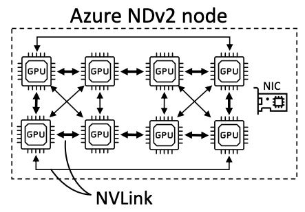
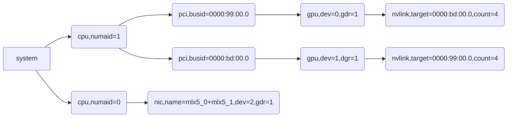
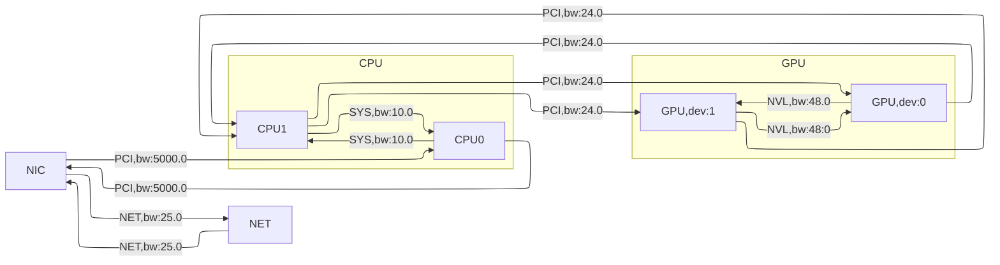

# NCCL Communicator Initialization #03: Conversion from XML to Topo

## Control Flow

- [ncclCommInitRank()](https://github.com/NVIDIA/nccl/blob/v2.25.1-1/src/init.cc#L1715)
  - [`ncclCommInitRankFunc()`](https://github.com/NVIDIA/nccl/blob/v2.25.1-1/src/init.cc#L1340)
    - [`initTransportsRank()`](https://github.com/NVIDIA/nccl/blob/v2.25.1-1/src/init.cc#L659)
      - [`ncclTopoGetSystem()`](https://github.com/NVIDIA/nccl/blob/v2.25.1-1/src/graph/topo.cc#L492) 
        - [`ncclTopoGetSystemFromXml()`](https://github.com/NVIDIA/nccl/blob/v2.25.1-1/src/graph/topo.cc#L662) <- We are here!

Recall in the previous note, we introduce how `ncclTopoGetSystem()` detects and constructs the intra-node topology in the XML form that contains all the involved GPUs, NICs, PCI buses, and NVLinks in the communicator. However, XML's tree structure is not efficient for path finding and channel searching. Therefore, NCCL calls [`ncclTopoGetSystemFromXml()`](https://github.com/NVIDIA/nccl/blob/v2.25.1-1/src/graph/topo.cc#L1348) as the last step in [`ncclTopoGetSystemFromXml()`](https://github.com/NVIDIA/nccl/blob/v2.25.1-1/src/graph/topo.cc#L662) to convert this XML tree into a intra-node topology graph.

## Topology Representation

> **Note:** The term "node" has two possible meanings: (1) a machine, (2) a vertex in the graph. Please check the context for the exact meaning, and no ambiguity should arise. Mostly, we mean (2) in this note.

Similar to the fact that [`ncclXml`]([`ncclXml`](https://github.com/NVIDIA/nccl/blob/v2.25.1-1/src/graph/xml.h#L39)) holds the root of the XML tree, [`ncclTopoSystem`](https://github.com/NVIDIA/nccl/blob/v2.25.1-1/src/graph/topo.h#L161) stores all the nodes in the topology graph. It classfies nodes into [six categories](https://github.com/NVIDIA/nccl/blob/v2.25.1-1/src/graph/topo.h#L36-L42), namely GPU, PCI (i.e., PCI switch), NVS (i.e., NVSwitch), CPU (i.e., NUMA domains), NIC, and NET. Nodes within a category are stored in a [`ncclTopoNodeSet`](https://github.com/NVIDIA/nccl/blob/v2.25.1-1/src/graph/topo.h#L156). 

**A node has its own category-specific attributes and interconnect links to other nodes.** Category-specific attributes are implemented as [C union](https://github.com/NVIDIA/nccl/blob/v2.25.1-1/src/graph/topo.h#L121-L147). For example, GPU node has attributes GDR support and NVML device number, and CPU node has affinity attributes (i.e., which cores are in the same NUMA domain). Links are implemented as [`ncclTopoLink`](https://github.com/NVIDIA/nccl/blob/v2.25.1-1/src/graph/topo.h#L149), which contains [three attributes](https://github.com/NVIDIA/nccl/blob/v2.25.1-1/src/graph/topo.h#L90-L94): link type, bandwidth, and remote node (i.e., the other side of the link). There are [five link types](https://github.com/NVIDIA/nccl/blob/v2.25.1-1/src/graph/topo.h#L43-L52): `LINK_LOC` (i.e., from a node to itself), `LINK_NVL` (i.e., NVLink), `LINK_PCI` (i.e., PCI bus), `LINK_SYS` (i.e., link between NUMA nodes, typically QPI), `LINK_NET` (i.e., connection through the network).

**A node also contains [paths](https://github.com/NVIDIA/nccl/blob/v2.25.1-1/src/graph/topo.h#L151) to GPU and NIC nodes.** Each path is represented as [`ncclTopoLinkList`](https://github.com/NVIDIA/nccl/blob/v2.25.1-1/src/graph/topo.h#L99), which beyond an ordered collection of links, has an overall path type, count and bandwidth. Path type is quite similar to link type, but there are [ten types](https://github.com/NVIDIA/nccl/blob/v2.25.1-1/src/graph/topo.h#L55-L86). For example, `PATH_NVB` means a path through NVLinks and using an intermediate GPU (e.g., in NDv2, because not every pair of GPUs have direct NVLink connection on this machine; see the figure below). Count means the number of links in the path. Bandwidth is the smallest bandwidth among the links in the path. Based on the destination's node type, a node's paths are organized into [`struct ncclTopoLinkList* paths[NCCL_TOPO_NODE_TYPES];`](https://github.com/NVIDIA/nccl/blob/v2.25.1-1/src/graph/topo.h#L151). For example, if you need a node's path to the second CPU node, you only need to retrieve `node->paths[CPU]+1`.

> **Note:** You should be aware that there are node types (or category), link types, and path types. Don't mix them up.
>
> **Note:** The ten path types are defined in an order that a smaller path type is better than a larger one (in terms of the bandwidth/lantecy). E.g., `PATH_LOC` is 0, `PATH_NVL` is 1, `PATH_NET` is 8 (through the inter-node network), and `PATH_DIS` is 9 (disconnected paths). Their values are consecutive integers. Thus, relaxing and strengthening path type constraints in channel searching later on can simply be done by integer operations like increment and decrement, respectively.

## Conversion Procedure

> **Note:** To distinguish nodes in the XML tree and topology graph, we use the quoted name to refer to nodes in the XML tree, and capitalized name in the topology graph. For example, a "cpu" node is in the XML tree, while a CPU node is in the topology graph.

**`ncclTopoGetSystemFromXml()` starts by adding all CPU nodes to the topology graph via [`ncclTopoAddCpu()`](https://github.com/NVIDIA/nccl/blob/v2.25.1-1/src/graph/topo.cc#L669).** This method creates a CPU node and checks all the children of a "cpu" node in the XML tree, calling [`ncclTopoAddPci()`](https://github.com/NVIDIA/nccl/blob/v2.25.1-1/src/graph/topo.cc#L524) for the "pci" node and [`ncclTopoAddNic()`](https://github.com/NVIDIA/nccl/blob/v2.25.1-1/src/graph/topo.cc#L535) for the "nic" node. Particularly, for a "nic" node, `ncclTopoAddCpu()` [creates](https://github.com/NVIDIA/nccl/blob/v2.25.1-1/src/graph/topo.cc#L531) a NIC node, and connects it with the CPU node using PCI link via [`ncclTopoConnectNodes()` ](https://github.com/NVIDIA/nccl/blob/v2.25.1-1/src/graph/topo.cc#L532-L533) in two directions.

- [`ncclTopoAddPci()`](https://github.com/NVIDIA/nccl/blob/v2.25.1-1/src/graph/topo.cc#L407) also works recursively. It checks the children of a "pci" node in the XML tree, calling [`ncclTopoAddGpu()`](https://github.com/NVIDIA/nccl/blob/v2.25.1-1/src/graph/topo.cc#L427) for the "gpu" node, [`ncclTopoAddNic()`](https://github.com/NVIDIA/nccl/blob/v2.25.1-1/src/graph/topo.cc#L442) for the "nic" node, [`ncclTopoAddPci()`](https://github.com/NVIDIA/nccl/blob/v2.25.1-1/src/graph/topo.cc#L457) for the "pci" node. It finally adds PCI link in the [two directions](https://github.com/NVIDIA/nccl/blob/v2.25.1-1/src/graph/topo.cc#L471-L472) between its parent and the children via [`ncclTopoConnectNodes()`](https://github.com/NVIDIA/nccl/blob/v2.25.1-1/src/graph/topo.cc#L158). Similar to `ncclTopoAddCpu()`, for the "nic" node `ncclTopoAddPci()` will create a NIC node before calling `ncclTopoAddNic()`.

- [`ncclTopoAddNic()`](https://github.com/NVIDIA/nccl/blob/v2.25.1-1/src/graph/topo.cc#L380) calls [`ncclTopoAddNet()`](https://github.com/NVIDIA/nccl/blob/v2.25.1-1/src/graph/topo.cc#L351) to create a NET node and connect it with the NIC node via a NET link in the two directions via [`ncclTopoConnectNodes()`](https://github.com/NVIDIA/nccl/blob/v2.25.1-1/src/graph/topo.cc#L375-L376).

  > **Note:** It is unclear why NCCL delegates the job of creating NIC nodes and setting their attributes to the caller.

**Given nodes are added, `ncclTopoGetSystemFromXml()`  then adds NVLinks via [`ncclTopoAddNvLinks()`](https://github.com/NVIDIA/nccl/blob/v2.25.1-1/src/graph/topo.cc#L673).** It [recursively](https://github.com/NVIDIA/nccl/blob/v2.25.1-1/src/graph/topo.cc#L590) checks "nvlink" nodes. On finding such a node, it obtains the parent's `busId` (should be a "gpu" node), the remote type using its `tclass` attribute. There are three cases in `tclass`: (1) If the remote type is a GPU, this is a [P2P NV Link](https://github.com/NVIDIA/nccl/blob/v2.25.1-1/src/graph/topo.cc#L565); (2) If it is an NV switch, we create an [NVS](https://github.com/NVIDIA/nccl/blob/v2.25.1-1/src/graph/topo.cc#L573) node; (3) If it is a CPU, we find the corresponding CPU node. Whatever the case, we finally connect the two nodes by NVL link via [`ncclTopoConnectNodes()`](https://github.com/NVIDIA/nccl/blob/v2.25.1-1/src/graph/topo.cc#L578-L581).

**`ncclTopoGetSystemFromXml()`  then adds Chip-to-Chip (C2C) links via [ncclTopoAddC2c()](https://github.com/NVIDIA/nccl/blob/v2.25.1-1/src/graph/topo.cc#L674), PCI links via [ncclTopoAddPciLinks](https://github.com/NVIDIA/nccl/blob/v2.25.1-1/src/graph/topo.cc#L675), CPU-to-CPU links via [ncclTopoConnectCpus()](https://github.com/NVIDIA/nccl/blob/v2.25.1-1/src/graph/topo.cc#L678).** We omit details here, as their code is easy to grasp. You can try to understand it yourself.

**Finally, `ncclTopoGetSystemFromXml()` uses [`ncclTopoSortSystem()`](https://github.com/NVIDIA/nccl/blob/v2.25.1-1/src/graph/topo.cc#L346) to sort the lists in each node so that the best links appear first.** This facilitate channel seaching later on. The [order](https://github.com/NVIDIA/nccl/blob/v2.25.1-1/src/graph/topo.cc#L341-L345) is that NVLinks appear first, then PCI downlink, PCI uplink, and finally SYS link (e.g., QPI). Since `ncclTopoConnectNodes()` maintains links in a [descending order](https://github.com/NVIDIA/nccl/blob/v2.25.1-1/src/graph/topo.cc#L173-L180) of bandwidth, their is relatively little work to do in this sorting algorithm.

## Example

The input XML looks like this:

The resulting topology graph on our test machine is depicted below.

