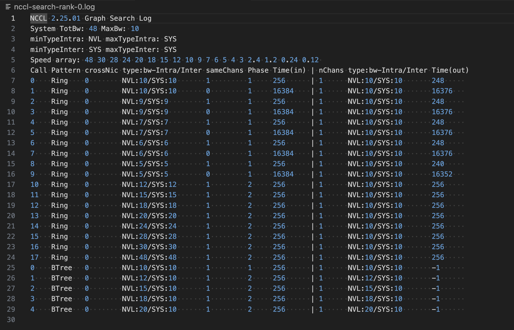
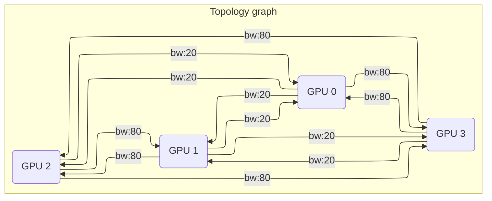
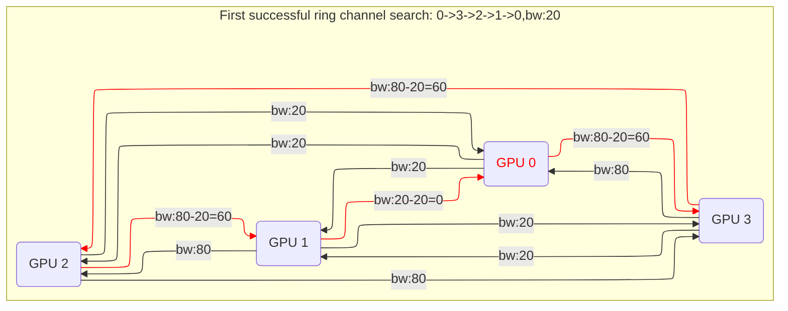
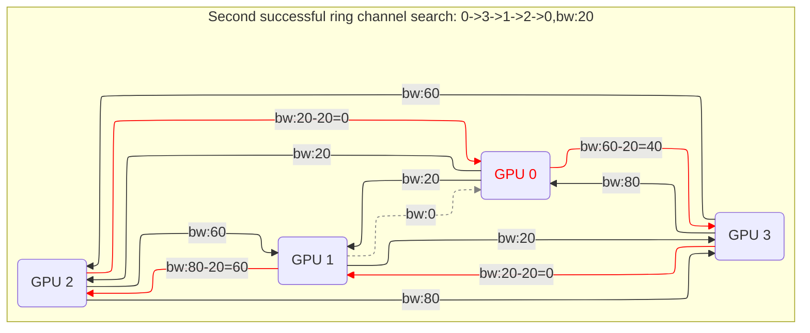
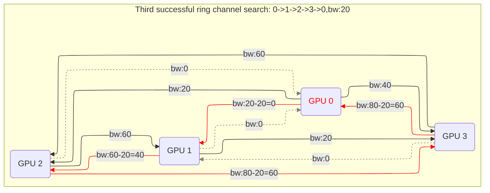
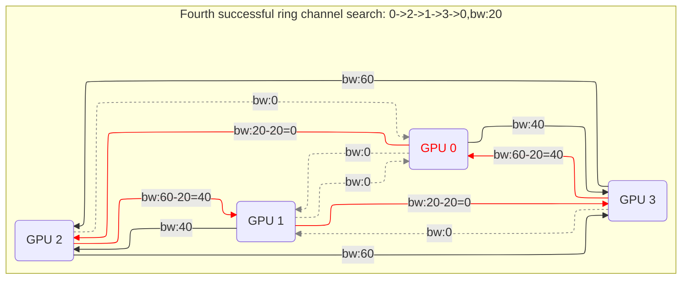

# NCCL Communicator Initialization #05: Channel Search

## Control Flow

[ncclCommInitRank()](https://github.com/NVIDIA/nccl/blob/v2.25.1-1/src/init.cc#L1715)

- [`ncclCommInitRankFunc()`](https://github.com/NVIDIA/nccl/blob/v2.25.1-1/src/init.cc#L1340)
  - [`initTransportsRank()`](https://github.com/NVIDIA/nccl/blob/v2.25.1-1/src/init.cc#L659) <- We are here!

In the previous note, we learned how the best paths are found between any two nodes in the local machine's intra-node topology. NCCL bundles several paths in a chain fashion to form a channel. NCCL tries to discover as many channels as possible, maximizing their combined bandwidth. At runtime, each channel will be used by an SM on each involved GPU, so multiple channels will transmit data in parallel. Note that an NCCL channel is not a physical wire but a logical term (like an abstraction of multiple physical wires). One straightforward constraint in channel search is that for each link, $\sum_{\mathrm{c\in channels}}\mathbb{I}\{\mathrm{link}\in c\}\cdot \mathrm{Bw}(c)\leq\mathrm{Bw}(\mathrm{link})$, i.e., the sum of the bandwidth of channels that pass through a link cannot exceed the link's bandwidth.

> **Note:** Don't confuse the concepts of a link, path, and channel. One or more chained links constitute a path, and one or more chained paths constitute a channel. A link corresponds to a physical wire that delivers the actual traffic. A path connects two nodes in the topology graph in a way that maximizes node-to-node bandwidth. A channel connects all relevant nodes in a certain order. When NCCL constructs channels, it only cares about paths that start from and end with NET/GPU nodes.

## Channel Search: Preparation

**[`ncclTopoSearchInit()`](https://github.com/NVIDIA/nccl/blob/v2.25.1-1/src/init.cc#L804) initializes `maxBw` and `totalBw` of a `ncclTopoSystem` (this is what we use to represent a topology graph). They provide the upper bound (i.e., the best we can hope for) of the bandwidth of a channel.** If there is only one GPU node and no NET node, these bandwidths are set to [`LOC_BW`](https://github.com/NVIDIA/nccl/blob/v2.25.1-1/src/graph/search.cc#L42-L46). Otherwise, based on whether there are NET nodes (i.e., the involved GPUs reside on different machines), it sets [`maxBw`](https://github.com/NVIDIA/nccl/blob/v2.25.1-1/src/graph/search.cc#L49) to the max bandwidth from a GPU node to NET nodes or GPU nodes. [`totalBw`](https://github.com/NVIDIA/nccl/blob/v2.25.1-1/src/graph/search.cc#L50) is the maximum bandwidth one GPU can [supply](https://github.com/NVIDIA/nccl/blob/v2.25.1-1/src/graph/search.cc#L32-L33) with its NVLink or PCI link.

**We need a new data structure to represent the chosen bundle of paths and nodes.** This is where [`ncclTopoGraph`](https://github.com/NVIDIA/nccl/blob/v2.25.1-1/src/include/graph.h#L80) comes into play. It records the channel search result, so it only contains some logical data that fully describes a channel. Later, when we build a channel, we need another struct [`ncclChannel`](https://github.com/NVIDIA/nccl/blob/v2.25.1-1/src/init.cc#L142) to describe runtime data, such as peer info and pointers. For now, take a look at `ncclTopoGraph`. 

- **Input constraints:** Fields like `pattern`, `crossNic`, `collNet`, `minChannels`, and `maxChannels` are provided as constraints or preferences that guide the graph's construction. The [`pattern`](https://github.com/NVIDIA/nccl/blob/v2.25.1-1/src/include/graph.h#L83) field provides a finer traffic routing description (see below). The [`crossNic`](https://github.com/NVIDIA/nccl/blob/v2.25.1-1/src/include/graph.h#L84) field implies whether the traffic can cross the NIC (i.e., crossing means the ingress NIC differs from the egress NIC on a machine). This is only [possible](https://github.com/NVIDIA/nccl/blob/v2.25.1-1/src/graph/search.cc#L947-L950) when each machine has multiple NICs for a multi-node task.
- **Output metrics:** After the topology is computed, fields such as `nChannels` (the number of channels found), `bwIntra`/`bwInter` (intra- and inter-connect bandwidth estimates), and `typeIntra`/`typeInter` (intra- and inter-connect path types) are populated to describe the quality of the connectivity.

**Every channel search of `initTransportsRank()` looks for a particular [pattern](https://github.com/NVIDIA/nccl/blob/v2.25.1-1/src/include/graph.h#L74-L79), which describes how we should route NIC (network) traffic and balance the load among GPUs.** You can think of it as a template describing how nodes are organized together to form a closed route (like in the traveling salesman problem). For example, a RING pattern means GPUs and NICs must be ordered in the form of `node-->node-->node`, and no branching is allowed (e.g., `node<--node-->node`). There are [six predefined patterns](https://github.com/NVIDIA/nccl/blob/v2.25.1-1/src/include/graph.h#L74-L79): BALANCED_TREE, SPLIT_TREE, TREE, RING, NVLS, and COLLNET_DIRECT. We illustrate four search patterns below, where `inter-node` and `intra-node` indicate whether this is a multi- or single-node task. Note that whatever the case is, NCCL only supports intra-node [chains or rings](https://github.com/NVIDIA/nccl/blob/v2.25.1-1/src/graph/search.cc#L710-L726). It does not support [intra-node trees](https://github.com/NVIDIA/nccl/issues/671#issuecomment-1099969023). Moreover, a tricky point is that all these patterns mostly affect inter-node rather than intra-node connections (i.e., how different machines are connected).

```mermaid
flowchart TD
  subgraph "<font color="red">Unsupported!!</font>"
    GPU__a(GPU a)-->GPU__b(GPU b)-->GPU__c(GPU c)
    GPU__a(GPU a)-->GPU__d(GPU d)
    linkStyle 0,1,2 stroke:red;
    style GPU__a fill:red;
    style GPU__b fill:red;
    style GPU__c fill:red;
    style GPU__d fill:red;
  end
  subgraph "Inter-node+Ring/Tree+crossNic=1"
    NET_0(NET x)-->GPU_1(GPU a)-->GPU_2(GPU b)-->GPU_3(GPU c)-->GPU_4(GPU d)-->NET_1(NET y)
  end
  subgraph "Inter-node+Ring/Tree+crossNic=0"
    NET0(NET x)-->GPU1(GPU a)-->GPU2(GPU b)-->GPU3(GPU c)-->GPU4(GPU d)-->NET0
  end
  subgraph "Intra-node+Tree"
    GPU_a(GPU a)-->GPU_b(GPU b)-->GPU_c(GPU c)-->GPU_d(GPU d)
  end
    subgraph "Intra-node+Ring"
    GPUa(GPU a)-->GPUb(GPU b)-->GPUc(GPU c)-->GPUd(GPU d)-->GPUa
  end
```



**`initTransportsRank()` searches for several [graphs](https://github.com/NVIDIA/nccl/blob/v2.25.1-1/src/init.cc#L834-L879) in different patterns based on the available networks: `ringGraph`, `treeGraph`, `collNetChainGraph`, `collNetDirectGraph`, and `nvlsGraph`.** The first two will always be searched. The third and fourth will be searched only if CollNet is available. [CollNet](https://github.com/NVIDIA/nccl/issues/320) is a network that allows GPUs on multiple nodes to perform in-network reductions (i.e., [SHARP](https://docs.nvidia.com/networking/display/sharpv300/using+nvidia+sharp+with+nvidia+nccl) done on IB switches). It is enabled via the network plugin `libnccl-net.so`. `nvlsGraph` will be searched if NVLS is supported. NVLS refers to NVLink SHARP (done on NVSwitch). It is enabled by [`ncclNvlsInit()`](https://github.com/NVIDIA/nccl/blob/v2.25.1-1/src/init.cc#L831) if possible.

## Channel Search: Overall Ideas

**[`ncclTopoCompute()`](https://github.com/NVIDIA/nccl/blob/v2.25.1-1/src/graph/search.cc#L945) searches the channel, which fills in the output metrics in `ncclTopoGraph` based on the input `pattern`. ** <font color="red">TODO: Overview</font>

**There are three constraints in channel search:**

1. `graph->sameChannels` is initially [set](https://github.com/NVIDIA/nccl/blob/v2.25.1-1/src/graph/search.cc#L969-L970) to 1,  which means all channels should use the same paths.
2. The path types to consider are those $\leq$ `graph->typeIntra` for intra-node communication and $\leq$ `graph->typeInter` for inter-node communication. All possible path types are within [`[minTypeIntra,maxTypeIntra]`](https://github.com/NVIDIA/nccl/blob/v2.25.1-1/src/graph/search.cc#L957-L958) for intra-node connections and within [`[minTypeIntra,maxTypeIntra]`](https://github.com/NVIDIA/nccl/blob/v2.25.1-1/src/graph/search.cc#L961-L962) for inter-node connections. Initially, they are set to the [best path types possible](https://github.com/NVIDIA/nccl/blob/v2.25.1-1/src/graph/search.cc#L966-L967) (i.e., `minTypeIntra` and `minTypeInter`, respectively). We are using $\leq$ because path types are consecutive integers, with the lower values being the better.
3. The combined bandwidth of all channels must $\geq$`graph->bwIntra` for intra-node communication and $\geq$`graph->bwInter` for inter-node communication. Their initial values are determined from one of the two hard-coded arrays, [`speedArrayIntra[]` and `speedArrayInter[]`](https://github.com/NVIDIA/nccl/blob/v2.25.1-1/src/graph/search.cc#L930-L943), based on (1) GPU's [compute capacity](https://github.com/NVIDIA/nccl/blob/v2.25.1-1/src/graph/search.cc#L1012-L1013) and (2) it is an [inter-/intra-node](https://github.com/NVIDIA/nccl/blob/v2.25.1-1/src/graph/search.cc#L1008) task. The initial bandwidths for `graph->bwIntra` and `graph->bwInter` are [the same](https://github.com/NVIDIA/nccl/blob/v2.25.1-1/src/graph/search.cc#L1021), which is [$\max_{s\in\mathrm{speed\ array}}\{s:s\leq\mathrm{MaxBw}\wedge s\cdot(\mathrm{min\#channels})\leq\mathrm{TotalBw}\}$](https://github.com/NVIDIA/nccl/blob/v2.25.1-1/src/graph/search.cc#L1020).

**[`ncclTopoSearchRec()`](https://github.com/NVIDIA/nccl/blob/v2.25.1-1/src/graph/search.cc#L1030) carries out the actual searching.** `Rec` stands for "recursive". It fills in the searched result upon every invocation into its third argument `saveGraph`. Before delving into its logic, we first look at how `ncclTopoCompute()` uses this subroutine.

**`ncclTopoCompute()` uses two phases to determine the final channels: (1) [feasibility search phase](https://github.com/NVIDIA/nccl/blob/v2.25.1-1/src/graph/search.cc#L042-L1098), and (2) [solution augment phase](https://github.com/NVIDIA/nccl/blob/v2.25.1-1/src/graph/search.cc#L1100-L1132).** The current phase is indicated by the [`pass`](https://github.com/NVIDIA/nccl/blob/v2.25.1-1/src/graph/search.cc#L1015) variable (1=Phase 1, 2=Phase 2). Moreover, there is a time limit in every call to [`ncclTopoCompute()`](https://github.com/NVIDIA/nccl/blob/v2.25.1-1/src/graph/search.cc#L1025-L1026). Every time a recursive function is called, this `time` variable is [decremented](https://github.com/NVIDIA/nccl/blob/v2.25.1-1/src/graph/search.cc#L508). On modern CPUs, this roughly corresponds to $\leq$1 second. If no solution can be found within this time limit, it falls back to a simple order where GPU $i$ connects to GPU $(i+1)$.

- Phase 1's idea is to find a feasible solution. Since the initial three constriants may be too strong to yield any results, it relaxes the constraints in the order they are listed above. Specifically, it first tries to allow [different channels](https://github.com/NVIDIA/nccl/blob/v2.25.1-1/src/graph/search.cc#L1050). Then, it tries to relax [`typeIntra`](https://github.com/NVIDIA/nccl/blob/v2.25.1-1/src/graph/search.cc#L1070). If `typeIntra` cannot be relaxed further, it then tries to relax [`typeInter`](https://github.com/NVIDIA/nccl/blob/v2.25.1-1/src/graph/search.cc#L1076). If `typeInter` cannot be relaxed, it tries to decrease the speed by setting `bwIntra` and `beInter` to [the next value](https://github.com/NVIDIA/nccl/blob/v2.25.1-1/src/graph/search.cc#L1091) in the speed array. Every time after constraint relaxing, we conduct another search by calling `ncclTopoSearchRec()` [again](https://github.com/NVIDIA/nccl/blob/v2.25.1-1/src/graph/search.cc#L1030).

  > **Note 1:** When relaxing a later constriant, the prior constraint is restored to its initial value. For example, if we decide that `typeIntra` cannot be relaxed and turn to relaxing `typeInter`, the value of `typeIntra` is [restored](https://github.com/NVIDIA/nccl/blob/v2.25.1-1/src/graph/search.cc#L1073) to `minTypeIntra`. In other words, we are reluctant to decrease the bandwidth we expect from channels. We only decrease it when we know the current bandwidth is not feasible. Given a fixed bandwidth to search, we always prioritize certain path types before others (e.g., NVL>PCI>NET). Additionally, we wish multiple channels (if there are) use the same paths.
  >
  > **Note 2:** We omit two other constraint relaxing cases above for clarity: (1) Between `sameChannels` and `typeIntra`, it [tries](https://github.com/NVIDIA/nccl/blob/v2.25.1-1/src/graph/search.cc#L1061-L1065) a simpler pattern `TREE` if the current pattern is `BALANCED_TREE`. This value is NEVER restored once relaxed. (2) Between `typeInter` and `bwIntra`/`bwInter`, we [allow](https://github.com/NVIDIA/nccl/blob/v2.25.1-1/src/graph/search.cc#L1081-L1086) cross NIC traffic for patterns `RING` and `BALANCED_TREE` if `crossNic` is possible but disabled in the last search. This value is restored when we decrease the bandwidth.

- Phase 2's idea is that given a feasible soltion, we double-check it to ensure that bandwidth cannot be increased for the current solution. This is done by choosing all the previous bandwidth from the speed array and search again, [until](https://github.com/NVIDIA/nccl/blob/v2.25.1-1/src/graph/search.cc#L1115) the search time is used up or it is already the highest in the speed array.

For example, we show the calling history of `ncclTopoSearchRec()` on our test machine. Columns to the left of `|` mean search input, and to the right mean search output. We can see that it searches for two patterns: RING and BALANCED_TREE. The calling history does not perfectly match the mental model we just described, because there are many grimmy (and somewhat ad-hoc) if-else conditions that affect the control flow. At least, we can convince ourself that the overall relaxation procedure matches our previous description. (Personally, I think NCCL code should be refactored to tidy up these conditions.)



> **Note:** Since ranks on the same machine works on the same topology graph and the search procedure are deterministic and independent on the rank order, they have the same calling history. Other rank's search history are the same as in the above figure.

## Channel Search: Details

>  **Note:** The term "node" has two possible meanings: (1) a machine, (2) a vertex in the graph. Please check the context for the exact meaning, and no ambiguity should arise.

[`ncclTopoSearchRec()`](https://github.com/NVIDIA/nccl/blob/v2.25.1-1/src/graph/search.cc#L742) returns a channel search result upon each invocation. It incrementally fills in the data in the `saveGraph` argument based on the inputs in the argument `graph`. It searches in [steps](https://github.com/NVIDIA/nccl/blob/v2.25.1-1/src/graph/search.cc#L337) (see the `step` argument), where in each step one more GPU/NET node is added to the current channel. 

[`ncclTopoSearchParams()`](https://github.com/NVIDIA/nccl/blob/v2.25.1-1/src/graph/search.cc#L741) sets the end condition of a recursive pattern search, namely `backToNet` (i.e., at which step we should go back to the NET node) and `backToFirstRank` (i.e., at which step we should go back to the first GPU node). For an inter-node task and RING pattern, `backToNet` is [set](https://github.com/NVIDIA/nccl/blob/v2.25.1-1/src/graph/search.cc#L729) to $\#\mathrm{local\ GPUs}-1$, `backToFirstRank` [is](https://github.com/NVIDIA/nccl/blob/v2.25.1-1/src/graph/search.cc#L732) -1. For an intra-node task and RING pattern, `backToNet` is [set](https://github.com/NVIDIA/nccl/blob/v2.25.1-1/src/graph/search.cc#L734) to -1, and `backToFirstRank` [is](https://github.com/NVIDIA/nccl/blob/v2.25.1-1/src/graph/search.cc#L735) $\#\mathrm{local\ GPUs}-1$.

For an inter-node task, it starts from the node NET via [`ncclTopoSearchRecNet()`](https://github.com/NVIDIA/nccl/blob/v2.25.1-1/src/graph/search.cc#L746); otherwise, it starts from [`ncclTopoSearchTryGpu()`](https://github.com/NVIDIA/nccl/blob/v2.25.1-1/src/graph/search.cc#L754). Let's first lookt at `ncclTopoSearchRecNet()`, since it will call `ncclTopoSearchTryGpu()` after finding appropriate NICs.

- [`ncclTopoSearchRecNet()`](https://github.com/NVIDIA/nccl/blob/v2.25.1-1/src/graph/search.cc#L611) first finds appropriate NICs to start with via [`ncclTopoSelectNets()`](https://github.com/NVIDIA/nccl/blob/v2.25.1-1/src/graph/search.cc#L618), which selects NET nodes [close](https://github.com/NVIDIA/nccl/blob/v2.25.1-1/src/graph/search.cc#L456-L475) to GPU(s) (based on path types) or [satisfying](https://github.com/NVIDIA/nccl/blob/v2.25.1-1/src/graph/search.cc#L477-L495) `typeInter`. It then filters the returned NIC lists based on `bwInter`, `crossNic`, etc. If a NIC is chosen, it [subtracts](https://github.com/NVIDIA/nccl/blob/v2.25.1-1/src/graph/search.cc#L634) `bwInter` from the corresponding NET node's bandwidth. The next job is to choose a GPU. There are two cases.

  - If there is already a channel, it will try to replay the last channel by starting from [the same GPU](https://github.com/NVIDIA/nccl/blob/v2.25.1-1/src/graph/search.cc#L662-L663).
  - Otherwise, it tries the PCI order first to set a reference by calling `ncclTopoSearchTryGpu(system, graph, saveGraph, /* step */0, backToNet, backToFirstRank, /* search order */FORCED_ORDER_PCI, /*step limit*/&t, /*node type*/NET, /*chosen NIC's index*/n, /*GPU node's index*/0)`. It intends to provide a [quick](https://github.com/NVIDIA/nccl/blob/v2.25.1-1/src/graph/search.cc#L669) initial solution if possible, so the step limit is only 1024. After that, it tries to start with the most local GPUs (i.e., having the highest bandwidth to the NET node) again by calling [`ncclTopoSearchTryGpu()`](https://github.com/NVIDIA/nccl/blob/v2.25.1-1/src/graph/search.cc#L689), although with different arguments.

  Once the process is done, the previously subtracted `bwInter` is [restored](https://github.com/NVIDIA/nccl/blob/v2.25.1-1/src/graph/search.cc#L699) to prevent modifications to the topology graph.

- [`ncclTopoSearchTryGpu()`](https://github.com/NVIDIA/nccl/blob/v2.25.1-1/src/graph/search.cc#L337) tries if the path from a node `node[type].index` to a GPU node `node[GPU].g` (`type`, `index`, and `g` are its arguments) is valid  and chooses the next node. It checks the path's validity by calling [`ncclTopoFollowPath()`](https://github.com/NVIDIA/nccl/blob/v2.25.1-1/src/graph/search.cc#L340) and recursively sets the GPU node by calling [`ncclTopoSearchRecGpu()`](https://github.com/NVIDIA/nccl/blob/v2.25.1-1/src/graph/search.cc#L343).

  - [`ncclTopoFollowPath()`](https://github.com/NVIDIA/nccl/blob/v2.25.1-1/src/graph/search.cc#L150) mainly checks if the path's type satisfies and there is enough residual bandwidth on each link. It uses `typeIntra` and `bwIntra` as criterion if the two ends are [GPU/NVS](https://github.com/NVIDIA/nccl/blob/v2.25.1-1/src/graph/search.cc#L136-L138) nodes; otherwise, `typeInter` and `bwInter` are used (e.g., one end is a NET node). It has a `multi` argument, which stands for multiplication factor. Assigning it 1 means subtracting/counting the bandwidth (on each link in the path), while assigning it -1 means restoring/resuming the bandwidth (on each link in the path). This is why we can see [a second call](https://github.com/NVIDIA/nccl/blob/v2.25.1-1/src/graph/search.cc#L345) to `ncclTopoFollowPath()` in `ncclTopoSearchTryGpu()`with `-1` in the place of `multi` on backtracking.
  - [`ncclTopoSearchRecGpu()`](https://github.com/NVIDIA/nccl/blob/v2.25.1-1/src/graph/search.cc#L505) searches GPU using a DFS algorithm, which enumerates next GPU nodes, performs recursive search for each of them, and ends the search when either `time` or `step` indicates so.
    1. How to enumerate next GPU nodes depends on the search order. There are three orders: (1) `FORCED_ORDER_PCI` means trying GPU in the PCI index order, so there is only [one possible next GPU](https://github.com/NVIDIA/nccl/blob/v2.25.1-1/src/graph/search.cc#L579-L580). (2) `FORCED_ORDER_REPLAY` means trying GPU in the order of a previously discovered channel, so there is only [one possible next GPU](https://github.com/NVIDIA/nccl/blob/v2.25.1-1/src/graph/search.cc#L582-L583). (3) No restriction means any GPU can be tried as the next one. It obtains an ordered list of next GPUs sorted by the path quality via [`ncclTopoSearchNextGpuSort()`](https://github.com/NVIDIA/nccl/blob/v2.25.1-1/src/graph/search.cc#L585), and calls [`ncclTopoSearchTryGpu()`](https://github.com/NVIDIA/nccl/blob/v2.25.1-1/src/graph/search.cc#L588) on every candidate to expand the next node. Specifically, [`ncclTopoSearchNextGpuSort()`](https://github.com/NVIDIA/nccl/blob/v2.25.1-1/src/graph/search.cc#L241) filters out [inaccessible GPUs](https://github.com/NVIDIA/nccl/blob/v2.25.1-1/src/graph/search.cc#L254) (from the current GPU node) and already [chosen GPUs](https://github.com/NVIDIA/nccl/blob/v2.25.1-1/src/graph/search.cc#L255). It then records [path information](https://github.com/NVIDIA/nccl/blob/v2.25.1-1/src/graph/search.cc#L256-L259) like $\#\mathrm{hops}$ and `intraBw` in a [score](https://github.com/NVIDIA/nccl/blob/v2.25.1-1/src/graph/search.cc#L248) structure, and applies a [scoring function](https://github.com/NVIDIA/nccl/blob/v2.25.1-1/src/graph/search.cc#L269) to evaluate and sort these GPUs with respect to the current GPU node.
    2. Several conditions end the recursive search. (1) `time` is [up](https://github.com/NVIDIA/nccl/blob/v2.25.1-1/src/graph/search.cc#L507). (2) When `step` reaches [`backToNet`](https://github.com/NVIDIA/nccl/blob/v2.25.1-1/src/graph/search.cc#L529), we need to find the ultimate NET node instead of trying the next GPU node. If `crossNic` is disallowed, this final NET node must [equal](https://github.com/NVIDIA/nccl/blob/v2.25.1-1/src/graph/search.cc#L545) the initial NET node. This only happens for inter-node tasks. (3) When `step` reaches [`backToFirstRank`](https://github.com/NVIDIA/nccl/blob/v2.25.1-1/src/graph/search.cc#L590), we need to go back to the initial GPU node rather than trying the next one. This only happens for intra-node tasks.

## Example

Every time a graph is searched (i.e., `ringGraph`, `treeGraph`, `collNetChainGraph`, `collNetDirectGraph`, and `nvlsGraph`), NCCL produces an INFO log as follows, which shows the pattern, `crossNic`, number of channels, `bwIntra`/`bwInter`, `typeIntra`/`TypeInter`, `sameChannels`, and the graph sequentially. This log comes from `ringGraph` search.

```
sz-k8s-master:33418:33469 [1] NCCL INFO Pattern Ring, crossNic 0, nChannels 1, bw 10.000000/10.000000, type NVL/SYS, sameChannels 1
sz-k8s-master:33418:33469 [1] NCCL INFO  0 : NET/0-2 GPU/0 GPU/1 NET/0-2
```

Nevertheless, our test machine's topology is a bit too simple. Let's look at an example from [this blog](https://blog.csdn.net/u014443578/article/details/136902252) (in Chinese). The topology graph is depicted as below. We assume (1) all paths between the GPU nodes comprise only one link; (2) this is a single-node task, so we omit NET and NIC nodes; (3) all 4 GPUs are in the same NUMA node, so we omit CPU nodes; (4) the pattern is RING.



Path bandwidths differ among GPUs since the numbers of NVLinks differ. Given the speed array `float sm90SpeedArrayIntra[] = { 60.0, 50.0, 40.0, 30.0, 24.0, 20.0, 15.0, 12.0, 11.0, 6.0, 3.0 };`, the algorithm starts from a bandwidth of `60.0`, but none can be found. Since `minTypeIntra` equals `maxTypeIntra`, path types cannot be relaxed, it then decreases the bandwidth to `40.0` but none can be found.

Next, it tries bandwidth `20.0` and starts from GPU 0. Since no channel has been found yet, there is no restriction in the search order. It evaluates and ranks the paths from GPU 0 to 1,2,3, knowing that GPU 3 (bw:80) is the best candidate for the next GPU. Similarly, on GPU 3, it decides that the path to GPU 2 is the best one available. We omit  the rest process here. It discovers the first ring channel: `0->3->2->1->0`, with a bandwidth of 20.



For the second channel, it tries to replay the first channel. However, it fails because the path from GPU 1 to GPU 0 has no residual bandwidth. Hence, it starts anew from GPU 0. The DFS branch goes to GPU 3 first because GPU 3 is still the best candidate. Next, the DFS branch goes to GPU 2 (since GPU 2 is still the best candidate for GPU 3 except for GPU 0) fails as no ring can be formed. It backtracks and tries the second best candiate GPU 1. We omit  the rest process here. It discovers the second ring channel: `0->3->1->2->0`, also with a bandwidth of 20.



The search procedure afterwards is quite similar to the above, so we only gives a pictorial description below. Eventually, it discovers exactly four ring channels, all of which have a bandwidth of `20.0`.





## Second AllGather in `initTransportsRank()`

Here comes the second AllGather in `initTransportsRank()`. Recall that the first AllGather uses the boostrap network (`comm->bootstrap`) to share peers' info (`comm->peerInfo`) with each other. [The second AllGather](https://github.com/NVIDIA/nccl/blob/v2.25.1-1/src/init.cc#L913) again uses the bootstrap network to share the [five graphs above](https://github.com/NVIDIA/nccl/blob/v2.25.1-1/src/init.cc#L896-L905) with each other.

> **Note 1:** You may notice that the number of graphs in the second AllGather is actually [seven](https://github.com/NVIDIA/nccl/blob/v2.25.1-1/src/init.cc#L539) (also the value of the macro [`NCCL_NUM_ALGORITHMS`](https://github.com/NVIDIA/nccl/blob/v2.25.1-1/src/include/nccl_common.h#L54)). This is because the `nvlsGraph` and `treeGraph` both appear twice in this array.

> **Note 2:** Recall that there is also an intra-node AllGather after each peer detects its local XML tree. Thereby, a peer fuses the XML trees from all local ranks so that peers on the same machine have a unified picture of the local machine's hardware topology. This AllGather does not involve all ranks, but every group of ranks that reside on one machine.