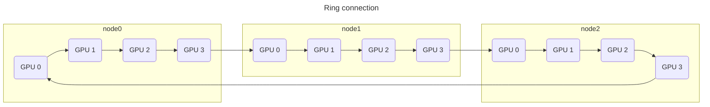

# NCCL Communicator Initialization #06: Channel Connection

## Control Flow

[ncclCommInitRank()](https://github.com/NVIDIA/nccl/blob/v2.25.1-1/src/init.cc#L1715)

- [`ncclCommInitRankFunc()`](https://github.com/NVIDIA/nccl/blob/v2.25.1-1/src/init.cc#L1340)
  - [`initTransportsRank()`](https://github.com/NVIDIA/nccl/blob/v2.25.1-1/src/init.cc#L659) <- We are here!

In the previous note, we learned how channels are built by each rank. But, since a channel is still inta-node, we need to connect channels on different machines to form a global topology. Now we can understand why NCCL does not support intra-node trees: It creates multiple (and arbitrarily many) endpoints to connect to other machines!

## Channel Connect: Preparation

Previously, we mentioned that the searched graphs are the data in the second All-Gather. But one more piece of information participates in this All-Gather: [`topoRanks`](https://github.com/NVIDIA/nccl/blob/v2.25.1-1/src/init.cc#L688). This structure is defined [here](https://github.com/NVIDIA/nccl/blob/v2.25.1-1/src/include/graph.h#L105-L115), which stores the previous and next ranks in each channel and describes how to build cross-machine connections. [`ncclTopoPreset()`](https://github.com/NVIDIA/nccl/blob/v2.25.1-1/src/init.cc#L911) fills its initial data, plus some information in `comm->channels`. It iterates over graphs. Let's take the [ring graph](https://github.com/NVIDIA/nccl/blob/v2.25.1-1/src/graph/connect.cc#L45-50), for example. `topoRanks->ringRecv` is [set](https://github.com/NVIDIA/nccl/blob/v2.25.1-1/src/graph/connect.cc#L46) as the first GPU node in the ring channel. `topoRanks->ringSend` is [set](https://github.com/NVIDIA/nccl/blob/v2.25.1-1/src/graph/connect.cc#L47) as the last GPU node in the ring channel. When inter-node communication is needed, these ranks should call network receive/send. `topoRanks->ringPrev` is [set](https://github.com/NVIDIA/nccl/blob/v2.25.1-1/src/graph/connect.cc#L48) to the previous node in the ring graph, or `-1` if it is the first node. Similarly, `topoRanks->ringNext` is [set](https://github.com/NVIDIA/nccl/blob/v2.25.1-1/src/graph/connect.cc#L49) to the next node in the ring graph, or `-1` if it is the last node. Moreover, `ncclTopoPreset()` [duplicates](https://github.com/NVIDIA/nccl/blob/v2.25.1-1/src/graph/connect.cc#L68-L71) channels. This issue [mentions](https://github.com/NVIDIA/nccl/issues/578) doubling channels helps increase bandwidth utilization, although I don't quite understand. Now comes 

After the second All-Gather, each rank [computes](https://github.com/NVIDIA/nccl/blob/v2.25.1-1/src/init.cc#L919-L939) the node (i.e., machine) where each peer resides and the first rank on each node. For example, assuming two nodes and 16 GPUs, if we have the following rings, the `nodesFirstRank` on nodes 0 and 1 are `0` and `10`, respectively. We skip the rest of the logic that computes other information (e.g., [the mapping from local rank to rank](https://github.com/NVIDIA/nccl/blob/v2.25.1-1/src/init.cc#L971-L974)). The final logging of this part summarizes the result in two lines below on our test machine.

```
# Node 0
graph->intra: GPU/0 GPU/7 GPU/6 GPU/3 GPU/2 GPU/5 GPU/4 GPU/1
graph->inter: NET/0 NET/0
# Node 1
graph->intra: GPU/10 GPU/9 GPU/8 GPU/13 GPU/12 GPU/15 GPU/14 GPU/11
graph->inter: NET/0 NET/0
```

```
sz-k8s-master:33419:33468 [0] 538.843151 initTransportsRank:977 NCCL TRACE hostHash[0] 18978393a42ab236 localRank 0 localRanks 2 localRank0 0
sz-k8s-master:33419:33468 [0] NCCL INFO comm 0x559aee18ecf0 rank 0 nRanks 4 nNodes 2 localRanks 2 localRank 0 MNNVL 0
```

## Channel Connect: 

[`ncclTopoPostset()`](https://github.com/NVIDIA/nccl/blob/v2.25.1-1/src/init.cc#L1026) connects the channels on different machines. It [flattens](https://github.com/NVIDIA/nccl/blob/v2.25.1-1/src/graph/connect.cc#L392-L420) all peers' `topoRanks` (containing several arrays of shape `int [MAXCHANNELS]`) into several large 1-dim arrays of shape `int [comm->nRanks*MAXCHANNELS]`. Then, it calls `connectRings()` to connect different nodes in a ring format, and calls `connectTrees` to connect them in a tree format. A pictorial view is given as follows.



In the [ring connection](https://github.com/NVIDIA/nccl/blob/v2.25.1-1/src/graph/connect.cc#L93), the [previous node's send rank](https://github.com/NVIDIA/nccl/blob/v2.25.1-1/src/graph/connect.cc#L103) is the [previous rank](https://github.com/NVIDIA/nccl/blob/v2.25.1-1/src/graph/connect.cc#L104) of the first rank on the current node. (This is where we filled in `-1` in `topoRanks->ringPrev` previously.) Also, the next node's [receive rank](https://github.com/NVIDIA/nccl/blob/v2.25.1-1/src/graph/connect.cc#L106) is the [next rank](https://github.com/NVIDIA/nccl/blob/v2.25.1-1/src/graph/connect.cc#L107) of the last rank on the current node. (This is where we previously filled in -1 in `topoRanks->ringNext`.)

> **Note:** Since different machines may have different numbers of channels, before calling `ncclTopoPostset`, the number of channels is [set](https://github.com/NVIDIA/nccl/blob/v2.25.1-1/src/init.cc#L993-L1002) to the minimal value in each graph on all the peers.

 [tree connection](https://github.com/NVIDIA/nccl/blob/v2.25.1-1/src/graph/connect.cc#L136) <font color="red">TODO: Building dual binary tree (GTC S31880)</font>