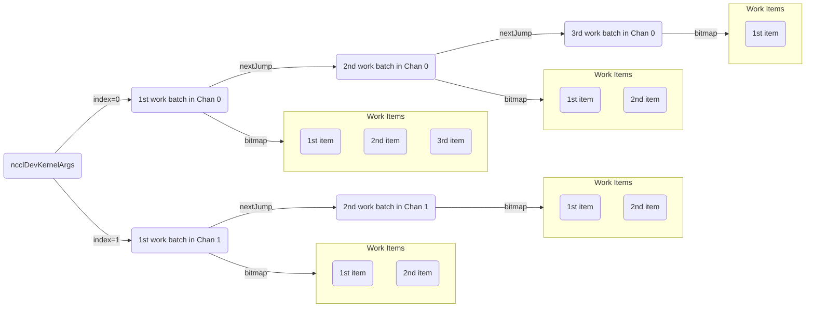
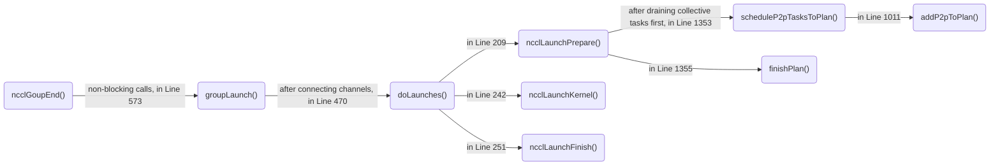
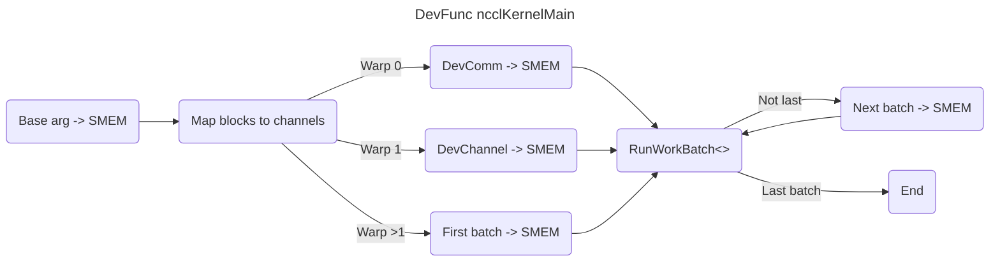
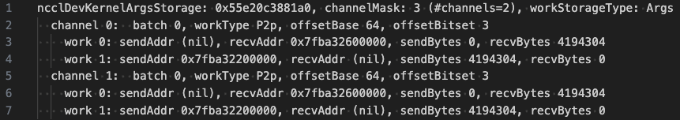
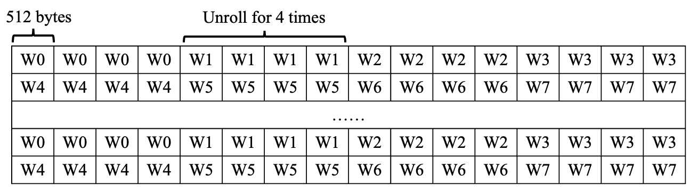

# NCCL Runtime #09: P2P Functions

As we mentioned in [`07-transport-setup`](07-transport-setup.md), during communicator initialization, [`ncclTopoComputeP2pChannels()`](https://github.com/NVIDIA/nccl/blob/v2.25.1-1/src/init.cc#L1046) determines `comm->p2pnChannels` (number of channels needed by P2P functions) and `comm->p2pnChannelsPerPeer` (the number of channels used by every P2P connection). Both of them are [a power of two](https://github.com/NVIDIA/nccl/blob/v2.25.1-1/src/graph/paths.cc#L802-803). If `comm->p2pnChannels` is greater than `comm->nChannels`, `ncclTopoComputeP2pChannels()` will also initialize these `comm->p2pnChannels - comm->nChannels` channels.

> **Note:** If needed, review [`07-transport-setup`](07-transport-setup.md) for details about `ncclChannel` and `ncclConnector`.

## Preparation #1: P2P Task Enqueueing

The [overview](nccl-overview.md) mentioned that all NCCL calls can be considered async. Therefore, we need a structure to pass information about an NCCL call between functions. The structure must fully describe a task. This is what [`struct ncclInfo`](https://github.com/NVIDIA/nccl/blob/v2.25.1-1/src/include/info.h#L15-L31) does. Its key members include the NCCL function, send/receive buffers, peer rank for p2p functions, the NCCL communicator, CUDA stream, chunk size, and slice steps.

**`ncclSend()` and `ncclRecv()` only enqueue the corresponding `ncclInfo` into the communicator's `comm->planner` via [`ncclEnqueueCheck()`](https://github.com/NVIDIA/nccl/blob/v2.25.1-1/src/collectives.cc#L160).** Most `ncclInfo` fields are a direct copy of the functions' arguments [`ncclEnqueueCheck()`](https://github.com/NVIDIA/nccl/blob/v2.25.1-1/src/enqueue.cc#L2204) does the following three things:

1. It generates a [`ncclTaskP2p`](https://github.com/NVIDIA/nccl/blob/v2.25.1-1/src/enqueue.cc#L2093) that is enqueued in the [per-peer P2P task queue](https://github.com/NVIDIA/nccl/blob/v2.25.1-1/src/enqueue.cc#L2101), which is either `comm->planner->peers[peer].sendQueue` or `comm->planner->peers[peer].recvQueue`. The planner also keeps a counter [`planner->nTasksP2p`](https://github.com/NVIDIA/nccl/blob/v2.25.1-1/src/enqueue.cc#L2103) to know how many P2P tasks to launch when the group call ends.
2. It ensures the channels to use are connected. Specifically, each P2P uses only one connector. If I talk to that peer for the [first](https://github.com/NVIDIA/nccl/blob/v2.25.1-1/src/enqueue.cc#L2107-L2108) time in the group, NCCL must establish the GPU‑to‑GPU FIFO connector. It does so by [checking](https://github.com/NVIDIA/nccl/blob/v2.25.1-1/src/enqueue.cc#L2118) the `connected` flag in the corresponding connector, [marking](https://github.com/NVIDIA/nccl/blob/v2.25.1-1/src/enqueue.cc#L2119) channels that still need a FIFO set‑up handshake in `comm->connectSend[peer]` and `comm->connectRecv[peer]`, and [flagging](https://github.com/NVIDIA/nccl/blob/v2.25.1-1/src/enqueue.cc#L2120) the communicator so that `ncclGroupEnd()` will drive the connector handshake before any kernel is launched.
3. It maintains a list of [distinct CUDA streams](https://github.com/NVIDIA/nccl/blob/v2.25.1-1/src/enqueue.cc#L2177-L2200) in the current group in `comm->planner`. NCCL will launch one kernel, if possible, when the group ends. 

## Preparation #2: Kernel Plan

The task description does not suffice since we want to combine multiple calls in a group into as few kernel launches as possible. We must combine multiple tasks so the kernel knows all its tasks. More specifically, each channel should know its tasks. Therefore, we need a device-friendly description that specifies what each block (equivalently, channel) should do in each kernel launch. This description is passed to the kernel as a kernel argument (just like a function argument, except that it is passed to the device on kernel launch), and is loaded from host memory to the GPU when the kernel starts. If this description is too large in size, we may need to break it into multiple arguments and launch multiple kernels correspondingly.

**This is where the kernel plan kicks into play. Each kernel plan corresponds to one kernel launch.** It is a self‑contained record ([`struct ncclKernelPlan`](https://github.com/NVIDIA/nccl/blob/master/src/include/comm.h#L236)) that lists which CUDA kernel to run, which channels are active (in the current kernel), the jobs of every block, and launch parameters (e.g., grid, block, shmem).

**How does each block in a kernel launch know what jobs to do?** There is a [`struct ncclDevKernelArgs`](https://github.com/NVIDIA/nccl/blob/master/src/include/comm.h#L249) in a kernel plan. In NCCL, a kernel argument is [`struct ncclDevKernelArgsStorage`](https://github.com/NVIDIA/nccl/blob/v2.25.1-1/src/include/device.h#L427-L433). Its size limit is currently set to [4 KB](https://github.com/NVIDIA/nccl/blob/v2.25.1-1/src/include/device.h#L435). You can think of it as a fixed base field ([`struct ncclDevKernelArgs`](https://github.com/NVIDIA/nccl/blob/v2.25.1-1/src/include/device.h#L412)) plus a variable number of [`struct ncclDevWorkBatch`](https://github.com/NVIDIA/nccl/blob/v2.25.1-1/src/include/device.h#L342). Each `ncclDevWorkBatch` describes a work batch in a channel. A **work batch** corresponds to one or several work items of the same type on a single channel. There are three work types: [`struct ncclDevWorkP2p`](https://github.com/NVIDIA/nccl/blob/master/src/include/device.h#L208),  [`struct ncclDevWorkColl`](https://github.com/NVIDIA/nccl/blob/master/src/include/device.h#L256), and [`struct ncclDevWorkCollReg`](https://github.com/NVIDIA/nccl/blob/v2.25.1-1/src/include/device.h#L321). Work batches that belong to the same channel are linked together via the [`nextJump`](https://github.com/NVIDIA/nccl/blob/v2.25.1-1/src/include/device.h#L348) variable. Every batch [points](https://github.com/NVIDIA/nccl/blob/master/src/include/device.h#L356-L360) to its work items by a base offset plus a bitmap. We depict the organization of a kernel argument as follows. We will see shortly that all threads in a block execute all work items in a batch in parallel, and they synchronize after finishing every work batch.

**The following invocation diagram shows how enqueued P2P tasks are transformed into one or more kernel plans**. The `groupLaunch()` will ensure the connections are established before launching kernels. By the time `ncclLaunchPrepare()` is called, all user calls inside the group (e.g., `ncclAllReduce()`, `ncclSend()`) have been converted into tasks and placed in P2P and collective queues inside `comm->planner`.  `ncclLaunchPrepare()` turns those raw tasks into one or more kernel plans, arranges CUDA‑stream dependencies, and (optionally) embeds the whole thing into a CUDA Graph capture if the user is capturing. It [loops](https://github.com/NVIDIA/nccl/blob/v2.25.1-1/src/enqueue.cc#L1327) until `planner->nTasksColl` and `planner->nTasksColl` are 0. A subtlety here is that collective tasks are partitioned first. The reason is that they must be sliced identically on every rank. Otherwise, the per‑channel shortest‑first picker would diverge. P2P tasks are local and can be cut anywhere, so they are scheduled only after the collective queue is empty.

> **Note:** This diagram is the control flow for a [blocking](https://docs.nvidia.com/deeplearning/nccl/archives/nccl_2143/user-guide/docs/usage/communicators.html#creating-a-communication-with-options) NCCL communicator, where `ncclGroupEnd()` will block until the enqueued tasks finish. Otherwise, the control flow in `ncclGroupEnd()` will differ in a nonblocking communicator: It creates a background [thread](https://github.com/NVIDIA/nccl/blob/v2.25.1-1/src/group.cc#L567) whose entry point is [`ncclAsyncJobMain()`](https://github.com/NVIDIA/nccl/blob/v2.25.1-1/src/group.cc#L71) to execute the job. We assume a blocking communicator because its control flow is easier to understand.

**`ncclLaunchPrepare()` internally calls [`scheduleP2pTasksToPlan()`](https://github.com/NVIDIA/nccl/blob/v2.25.1-1/src/enqueue.cc#L1353) to convert tasks to kernel plans.** Each kernel plan must fit within the two size limits in [`struct ncclKernelLaunchBudget`](https://github.com/NVIDIA/nccl/blob/v2.25.1-1/src/enqueue.cc#L247): `inArgsBytes` (the remaining space inside the kernel argument) and `outArgsByte` (the remaining space in the device work FIFO that accompanies the kernel). If any of them is [violated](https://github.com/NVIDIA/nccl/blob/v2.25.1-1/src/enqueue.cc#L1007), a new kernel plan will be generated in [the next loop](https://github.com/NVIDIA/nccl/blob/v2.25.1-1/src/enqueue.cc#L1328-L1360) in `ncclLaunchPrepare()`. Otherwise, this job is added to the kernel plan via [`addP2pToPlan()`](https://github.com/NVIDIA/nccl/blob/v2.25.1-1/src/enqueue.cc#L1011). Finally, a kernel argument is added to a plan via [`finishPlan()`](https://github.com/NVIDIA/nccl/blob/v2.25.1-1/src/enqueue.cc#L1355), and all kernel plans are [enqueued](https://github.com/NVIDIA/nccl/blob/v2.25.1-1/src/enqueue.cc#L1357) to `planner->planQueue`.

> **Note 1:** NCCL will add P2P tasks corresponding to different peers or streams to the same kernel plan as long as there is still space in the kernel argument to fit in.
>
> **Note 2:** When adding a job to a kernel plan, `scheduleP2pTasksToPlan()` decides which protocol to use. It only considers SIMPLE and LL. The criterion is using LL when the buffer size does not exceed [a threshold](https://github.com/NVIDIA/nccl/blob/v2.25.1-1/src/enqueue.cc#L778) and SIMPLE otherwise. This threshold is the maximum channel number times 16384 bytes [by default](https://github.com/NVIDIA/nccl/blob/v2.25.1-1/src/enqueue.cc#L765).
>
> **Note 3:** `scheduleP2pTasksToPlan()` also [enqueues](https://github.com/NVIDIA/nccl/blob/v2.25.1-1/src/enqueue.cc#L938) a proxy op when the send rank and receive rank are on different machines. The [`pattern`](https://github.com/NVIDIA/nccl/blob/v2.25.1-1/src/include/proxy.h#L71) in `struct ncclProxyOp` describes the op type. For `ncclSend()` and `ncclRecv()`, op types are [`ncclPatternSend`](https://github.com/NVIDIA/nccl/blob/v2.25.1-1/src/include/proxy.h#L34) and [`ncclPatternRecv`](https://github.com/NVIDIA/nccl/blob/v2.25.1-1/src/include/proxy.h#L35), respectively.

**How does `scheduleP2pTasksToPlan()` choose the kernel function to launch with?** It is selected by [`plan->kernelFn = ncclDevKernelForFunc[ncclDevFuncId_P2p()];`](https://github.com/NVIDIA/nccl/blob/v2.25.1-1/src/enqueue.cc#L964). The two symbols here (`ncclDevKernelForFunc` and `ncclDevFuncId`) are defined in a file `host_table.cc` that is generated from [`src/device/generate.py`](https://github.com/NVIDIA/nccl/blob/v2.25.1-1/src/device/generate.py) at build time. This file contains declarations of all available NCCL kernel functions pertinent to a GPU device, so its content may vary on different machines. In our case, `plan->kernelFn` points to the kernel function `ncclDevKernel_SendRecv`. This function is populated with the macro [`DEFINE_ncclDevKernel`](https://github.com/NVIDIA/nccl/blob/v2.25.1-1/src/device/common.h#L394) at build time. Internally, this function calls `ncclKernelMain<specializedFnId, RunWorkBatch<coll/*ncclFuncSendRecv*/, ty/*int8_t*/, redop<ty>/*FuncCopy<int8_t>*/, algo/*NCCL_ALGO_RING*/, proto/*NCCL_PROTO_SIMPLE*/>>(&args4K.args)`. We defer the details of the device function [`ncclKernelMain<>`](https://github.com/NVIDIA/nccl/blob/v2.25.1-1/src/device/common.h#L312) to the next part.

## Execution #1: P2P Kernel Launch

Before delving into kernels, we describe how NCCL enforces the semantics of group calls. Recall that NCCL launches one fused kernel that behaves as if every individual call had been issued on its own stream:

1. All work already enqueued on every user stream must finish before the kernel starts.
2. Work enqueued after the group must see the kernel’s completion when it uses the same stream.

**Since CUDA has no wait-on-many primitive, NCCL implements a [fan‑in$\to$kernel$\to$fan‑out](https://github.com/NVIDIA/nccl/blob/v2.25.1-1/src/enqueue.cc#L1367-L1380) chain with the help of a strong internal stream (i.e., `comm->sharedRes->deviceStream`).** The strong stream means that it serializes with every other stream. NCCL's fan‑in$\to$kernel$\to$fan‑out chain enforces this behavior. From the CUDA perspective, there is no weak stream other than regular streams. You can see [this reply](https://github.com/NVIDIA/nccl/issues/763#issuecomment-1366856684) for more information. Let us say $S_0,\dots,S_n$ are the user streams in a group ordered by their appearance, and $S$ is the strong stream. The chain is constructed as follows:

- **Fan‑in:** (Done in [`ncclLaunchPrepare()`](https://github.com/NVIDIA/nccl/blob/v2.25.1-1/src/enqueue.cc#L1320)) $S$ [waits](https://github.com/NVIDIA/nccl/blob/v2.25.1-1/src/enqueue.cc#L1386-L1388) on $S_1,\dots,S_n$; then the launch stream (i.e., $S_0$) [waits](https://github.com/NVIDIA/nccl/blob/v2.25.1-1/src/enqueue.cc#L1389) on $S$. Now $S$ and therefore the kernel launched on $S_0$ cannot start until all prior work on every $S_i$ has finished.
- **Kernel launch:** The NCCL kernel is [launched](https://github.com/NVIDIA/nccl/blob/v2.25.1-1/src/enqueue.cc#L1443) on $S_0$.
- **Fan‑out:** (Done in [`ncclLaunchFinish()`](https://github.com/NVIDIA/nccl/blob/v2.25.1-1/src/enqueue.cc#L1526)) Immediately after the launch, $S$ [waits](https://github.com/NVIDIA/nccl/blob/v2.25.1-1/src/enqueue.cc#L1538) on $S_0$, and each extra user stream [waits](https://github.com/NVIDIA/nccl/blob/v2.25.1-1/src/enqueue.cc#L1545-L1549) on $S$. This propagates the kernel’s completion back to all streams, so future work enqueued on any stream will wait for the kernel.

Kernel launch occurs in [`ncclLaunchKernel()`](https://github.com/NVIDIA/nccl/blob/v2.25.1-1/src/enqueue.cc#L1436). For CUDA >= 11.08, the CUDA function [`cuLaunchKernelEx()`](https://docs.nvidia.com/cuda/cuda-driver-api/group__CUDA__EXEC.html#:~:text=cuLaunchKernelEx) is [used](https://github.com/NVIDIA/nccl/blob/v2.25.1-1/src/enqueue.cc#L1500) to launch the kernel. The grid configuration is [`{(unsigned)nChannels, 1, 1};`](https://github.com/NVIDIA/nccl/blob/v2.25.1-1/src/enqueue.cc#L1440), and the block configuration is [`{(unsigned)plan->threadPerBlock, 1, 1};`](https://github.com/NVIDIA/nccl/blob/v2.25.1-1/src/enqueue.cc#L1441). The kernel function to execute is `ncclDevKernel_SendRecv`, which goes through the common entry point `ncclKernelMain<>`.

## Execution #2: P2P Kernel

**The P2P kernel calls the device function [`ncclKernelMain<>`](https://github.com/NVIDIA/nccl/blob/v2.25.1-1/src/device/common.h#L312), where each block finds its own kernel argument and finally calls to [`RunWorkBatch<coll, ty, redop<ty>, algo, proto>().run();`](https://github.com/NVIDIA/nccl/blob/v2.25.1-1/src/device/common.h#L404) to execute send/receive.** Here is the  working procedure for each block:

1. It [copies](https://github.com/NVIDIA/nccl/blob/v2.25.1-1/src/device/common.h#L319) the fixed base field of the launch arguments (i.e., [`struct ncclDevKernelArgs`](https://github.com/NVIDIA/nccl/blob/master/src/include/comm.h#L249)) into the SMEM.
2. Threads in a block will work for one channel, so we need to [map](https://github.com/NVIDIA/nccl/blob/v2.25.1-1/src/device/common.h#L326-L329) the block ID to the channel ID. For example, if the active channels are `0xF0` (i.e., Channels 4-7 are active), what channel will Block 0/2 take charge of? The answer is Channel 4/6. Specifically, Thread `x` (i.e., the Thread ID) in the block will check if Channel `x` is active. If yes, it counts the number of active channels below `x`. If the count equals the block ID, Thread `x` will write the Channel ID `x` to SMEM, so every thread in the channel will process this channel.
3. The first two warps (64 threads) in the block [load](https://github.com/NVIDIA/nccl/blob/v2.25.1-1/src/device/common.h#L336-L350) `ncclDevComm` and `ncclDevChannel` into SMEM, respectively. All other warps [load](https://github.com/NVIDIA/nccl/blob/v2.25.1-1/src/device/common.h#L352-L358) the channel's first work batch into SMEM.
4. All the warps [execute](https://github.com/NVIDIA/nccl/blob/v2.25.1-1/src/device/common.h#L371) the first batch by calling another kernel function, `ncclDevFunc_SendRecv<>`, which calls `RunWorkBatch<>` directly.
5. If this is not the last job in the channel, all the warps [load](https://github.com/NVIDIA/nccl/blob/v2.25.1-1/src/device/common.h#L337) the next batch into SMEM and [go](https://github.com/NVIDIA/nccl/blob/v2.25.1-1/src/device/common.h#L367-L389) to Step 4. After completing each work batch, there is a block-level synchronization [__syncthreads()](https://github.com/NVIDIA/nccl/blob/v2.25.1-1/src/device/common.h#L376). Otherwise, the kernel returns.

**We now discuss the implementation of `RunWorkBatch` for send/receive.** This template is specialized for sending and receiving in the file [`src/device/sendrecv.h`](https://github.com/NVIDIA/nccl/blob/v2.25.1-1/src/device/sendrecv.h#L12). The entry point is its `run()` method. Upon each invocation, it processes all the work items in a batch.

1. Since multiple channels can process a buffer in parallel, [Warp 0](https://github.com/NVIDIA/nccl/blob/v2.25.1-1/src/device/sendrecv.h#L65) finds the range of bytes in the P2P buffer that the current block needs to process. The first and last 16 threads in Warp 0 [handle](https://github.com/NVIDIA/nccl/blob/v2.25.1-1/src/device/sendrecv.h#L72-L84) the partitioning of the send and receive buffer, respectively.

2. It [computes](https://github.com/NVIDIA/nccl/blob/v2.25.1-1/src/device/sendrecv.h#L104-L106) the warp allocation per work item. That is, each warp knows which work item ([`workIx`](https://github.com/NVIDIA/nccl/blob/v2.25.1-1/src/device/sendrecv.h#L112) in the code) in the batch it handles, whether the work is a [send or receive](https://github.com/NVIDIA/nccl/blob/v2.25.1-1/src/device/sendrecv.h#L139-L141), and whether it is a [copy](https://github.com/NVIDIA/nccl/blob/v2.25.1-1/src/device/sendrecv.h#L142) (i.e., send/recv buffers are on the same GPU). Each warp also [computes](https://github.com/NVIDIA/nccl/blob/v2.25.1-1/src/device/sendrecv.h#L126-L137) the cooperative group to facilitate synchronization among threads that handle the same work item. Currently, a work batch can have at most [eight](https://github.com/NVIDIA/nccl/blob/v2.25.1-1/src/include/device.h#L341) P2P work items.

3. Based on copy/send/recv flags, it [chooses](https://github.com/NVIDIA/nccl/blob/v2.25.1-1/src/device/sendrecv.h#L156-L171) to call `reduceCopy<>`, `runSend<proto>`, or `runRecv<proto>`. The latter two instantiate [`Primitives`](https://github.com/NVIDIA/nccl/blob/v2.25.1-1/src/device/sendrecv.h#L21), which abstract the protocol and link type. `runSend<>` and `runRecv<>` advance [`chunkSize`](https://github.com/NVIDIA/nccl/blob/v2.25.1-1/src/device/sendrecv.h#L27) bytes in a loop, passing the byte range into [`prims.directSend()`](https://github.com/NVIDIA/nccl/blob/v2.25.1-1/src/device/sendrecv.h#L27) and [`prims.directRecv()`](https://github.com/NVIDIA/nccl/blob/v2.25.1-1/src/device/sendrecv.h#L44). `prims.directSend()` and `prims.directRecv()` call [`genericOp<>`](https://github.com/NVIDIA/nccl/blob/v2.25.1-1/src/device/prims_simple.h#L860) to do the real stuff. The user buffer that each invocation of `genericOp<>` processes is a **chunk**.

   > **Note:** If needed, review [`nccl-overview.md`](nccl-overview.md) for relationships between **chunk**, **slice**, and **step**. We will shortly discuss the latter two notions.

For example, given the kernel argument below, the kernel launch uses two blocks. Half of the warps (in a block) execute work item 0, and the other half execute work item 1. The two work items in the same batch are running in parallel.

**Case #1: Copy primitive, [reduceCopy<>](https://github.com/NVIDIA/nccl/blob/v2.25.1-1/src/device/common_kernel.h#L212).** It is called when the send rank equals the receive rank.

- It first [determines](https://github.com/NVIDIA/nccl/blob/v2.25.1-1/src/device/common_kernel.h#L224) `BigPackSize`, the number of consecutive bytes copied by each thread/lane in a for loop. Normally, it is 16 bytes. However, if the data is misaligned, it [falls back](https://github.com/NVIDIA/nccl/blob/v2.25.1-1/src/device/common_kernel.h#L257) to `sizeof(T)`, the size of an element in the buffer. In our case, since it is invoked with `/*T*/int8_t`, it falls back to 1 byte when the buffer is not 16-byte aligned.

- There are two nested copy loops. The inner loop is [unrolled](https://github.com/NVIDIA/nccl/blob/v2.25.1-1/src/device/common_kernel.h#L86) for `UNROLL` times, where a warp [grabs](https://github.com/NVIDIA/nccl/blob/v2.25.1-1/src/device/common_kernel.h#L137) the next ` 32 threads × BigPackSize` bytes every time. The kernel maintains [two counters](https://github.com/NVIDIA/nccl/blob/v2.25.1-1/src/device/common_kernel.h#L49-L50), `nBytesBehind` (i.e., already copied) and `nBytesAhead` (i.e., left to do), and the [outer loop](https://github.com/NVIDIA/nccl/blob/v2.25.1-1/src/device/common_kernel.h#L190-L191) continues until `nBytesAhead == 0`. For example, suppose we have a job of copying a 1 MB aligned buffer, and the previous warp allocation decides that eight warps should do this. Let's say `UNROLL=4`. Each warp will grab $4\times16\times32=2048$ bytes in an outer loop, and Warp $i$ will access the 2K bytes whose offset $\mod{2048\times8}$ equals $2048\times i$ to the head of the buffer. An illustration is as follows.

  

**Case #2: SendRecv primitive, [genericOp<>](https://github.com/NVIDIA/nccl/blob/v2.25.1-1/src/device/prims_simple.h#L191).** It is called when the send rank and receive rank differ. **We assume the SIMPLE protocol.** The [template arguments](https://github.com/NVIDIA/nccl/blob/v2.25.1-1/src/device/prims_simple.h#L190) of `genericOp<>` describe the direction of the data flow, and the [function arguments](https://github.com/NVIDIA/nccl/blob/v2.25.1-1/src/device/prims_simple.h#L192) describe the element offset into the user's input or output buffer and the number of elements to move. The last function argument, `postOp`, specifies whether the reduction post‑op is used (e.g., scale, cast). In our case, its value is false to indicate no post-op on the data.

Data are moved and synchronized on the two sides in [**slices**](https://github.com/NVIDIA/nccl/blob/v2.25.1-1/src/device/prims_simple.h#L306), and each warp copies [`sliceSize/32`](https://github.com/NVIDIA/nccl/blob/v2.25.1-1/src/device/prims_simple.h#L200-L201) of data each time using [`reduceCopy<>`](https://github.com/NVIDIA/nccl/blob/v2.25.1-1/src/device/prims_simple.h#L260) that we just discussed. Therefore, the movement of a slice constitutes the following steps:

1. **(Sender)** The kernel calls the helper function [`waitPeer<>`](https://github.com/NVIDIA/nccl/blob/v2.25.1-1/src/device/prims_simple.h#L243). This function waits via a [spin-loop](https://github.com/NVIDIA/nccl/blob/v2.25.1-1/src/device/prims_simple.h#L122-L126) until the remote peer is ready. This readiness is indicated through shared counters (`connStepPtr`, which lives in the pinned host memory, and its cached version, `connStepCache`). The wait loop ensures that the right data slice can be transferred safely. These counters are located in the host memory. [Reading](https://github.com/NVIDIA/nccl/blob/v2.25.1-1/src/device/prims_simple.h#L123) and [writing](https://github.com/NVIDIA/nccl/blob/v2.25.1-1/src/device/prims_simple.h#L186) these counters from the GPU requires special PTX instructions, e.g., [`st.volatile.global.u64`](https://github.com/NVIDIA/nccl/blob/v2.25.1-1/src/device/op128.h#L315).
2. **(Sender)** The kernel calls `reduceCopy<>` to move the slice from the send buffer to the destination buffer.
3. **(Sender)** After processing each slice, the kernel calls [`postPeer<>`](https://github.com/NVIDIA/nccl/blob/v2.25.1-1/src/device/prims_simple.h#L180). This function [increases](https://github.com/NVIDIA/nccl/blob/v2.25.1-1/src/device/prims_simple.h#L182) the internal step counter and writes the updated value back to the connection’s pointer ([`connStepPtr`](https://github.com/NVIDIA/nccl/blob/v2.25.1-1/src/device/prims_simple.h#L186)) so the peer side knows that a slice has been transferred.
4. **(Receiver)** The receiver `genericOp<>` also uses the `waitPeer<>` and `PostPeer<>` to coordinate data transmission slice-by-slice. We omit details here.

However, the `recvCopy<>`'s destination buffer and the proxy thread's involvement depend on the transport.

> **Note:** Pointers in a CUDA kernel do not have to be local (i.e., pointing to the device where it runs). A CUDA kernel can dereference a host pointer if UVA (Unified Virtual Address) is supported and the host memory is pinned (e.g., allocated by `cudaMallocHost()`). It can also dereference a device pointer pointing to another GPU's memory if the peer access is enabled.

- **Transport: Peer access.** Assume the sender and receiver GPUs have peer access (e.g., connected by NVLink), so a GPU can directly manipulate memory on another GPU. `waitPeer<>` will set the destination buffer to the [direct buffer](https://github.com/NVIDIA/nccl/blob/v2.25.1-1/src/device/prims_simple.h#L152), which points to the peer GPU's memory. Sender side's `reduceCopy<>` will directly copy its local buffer to the peer GPU's buffer. No proxy thread is involved.
- **Transport: Shared memory.** Assume the two GPUs are on the same machine but do not have peer access. Sender side's `reduceCopy<>` will copy its local buffer to host memory, and receiver side's `reduceCopy<>` will copy the host buffer to the destination buffer. No proxy thread is involved.
- **Transport: RDMA network.** It does not directly move data from the application’s send buffer into the network. Instead, it copies data from the user’s send buffer into an MR (equivalently, an RDMA‑registered staging area). Similar statements apply to the receiver side.  `waitPeer<>` will set the destination buffer to the [connection FIFO](https://github.com/NVIDIA/nccl/blob/v2.25.1-1/src/device/prims_simple.h#L156) (located in the registered MR).
  - **(Sender side proxy thread)** After fetching the proxy op from the queue, the proxy threads on both sides invoke the corresponding handler, i.e., [`progressOps()`](https://github.com/NVIDIA/nccl/blob/v2.25.1-1/src/proxy.cc#L722). It [repeatedly](https://github.com/NVIDIA/nccl/blob/v2.25.1-1/src/proxy.cc#L725-L739) invokes the [`proxyProgress`](https://github.com/NVIDIA/nccl/blob/v2.25.1-1/src/include/transport.h#L104) method in a transport class until the op is done. Since this is a net transport, this points to [`sendProxyProgress()`](https://github.com/NVIDIA/nccl/blob/v2.25.1-1/src/transport/net.cc#L1076) on the sender and [`recvProxyProgress()`](https://github.com/NVIDIA/nccl/blob/v2.25.1-1/src/transport/net.cc#L1230) on the receiver. `sendProxyProgress()` [checks](https://github.com/NVIDIA/nccl/blob/v2.25.1-1/src/transport/net.cc#L1133-L1135) whether the `recvTail` counter (i.e., `connStepPtr` from the GPU's viewpoint) is updated, and if so, it [invokes](https://github.com/NVIDIA/nccl/blob/v2.25.1-1/src/transport/net.cc#L1178) the `ncclNet`'s `isend` method to post an [RDMA Write With Immediate](https://github.com/NVIDIA/nccl/blob/v2.25.1-1/src/transport/net_ib.cc#L1892) request to the QP. It then [polls](https://github.com/NVIDIA/nccl/blob/v2.25.1-1/src/transport/net.cc#L1196) the CQ to know when each RDMA send is completed and [updates](https://github.com/NVIDIA/nccl/blob/v2.25.1-1/src/transport/net.cc#L1208) the `sendHead` counter. It also uses a [memory fence](https://github.com/NVIDIA/nccl/blob/v2.25.1-1/src/transport/net.cc#L1200) to ensure multiple memory writes are ordered.
  - **(Receiver side proxy thread)** Similarly, `recvProxyProgress()` [invokes](https://github.com/NVIDIA/nccl/blob/v2.25.1-1/src/transport/net.cc#L1335) the `ncclNet`'s `irecv` method to post a [RECV](https://github.com/NVIDIA/nccl/blob/v2.25.1-1/src/transport/net_ib.cc#L2144) request to the QP and [polls](https://github.com/NVIDIA/nccl/blob/v2.25.1-1/src/transport/net.cc#L1362) the CQ to know whether the request is completed. It finally [updates](https://github.com/NVIDIA/nccl/blob/v2.25.1-1/src/transport/net.cc#L1446) `recvTail` so the receiver GPU will know the incoming data.
