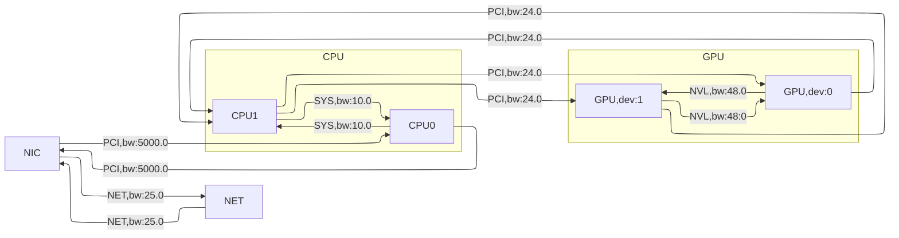

# NCCL Communicator Initialization #04: Path Finding

## Control Flow

- [ncclCommInitRank()](https://github.com/NVIDIA/nccl/blob/v2.25.1-1/src/init.cc#L1715)
  - [`ncclCommInitRankFunc()`](https://github.com/NVIDIA/nccl/blob/v2.25.1-1/src/init.cc#L1340)
    - [`initTransportsRank()`](https://github.com/NVIDIA/nccl/blob/v2.25.1-1/src/init.cc#L659) <- We are here!

Recall that we use  `ncclTopoGetSystem()` to obtain the intra-node topology graph. Now we find paths between GPUs and NICs. The corresponding code is [this](https://github.com/NVIDIA/nccl/blob/v2.25.1-1/src/init.cc#L797-L802), where it pre-computes paths between GPUs and NICs using [`ncclTopoComputePaths()`](https://github.com/NVIDIA/nccl/blob/v2.25.1-1/src/graph/paths.cc#L581), trimming inaccessible GPUs and unused NICs using [`ncclTopoTrimSystem()`](https://github.com/NVIDIA/nccl/blob/v2.25.1-1/src/graph/paths.cc#L682), and finally computes the paths again without the trimmed devices.

## Path Finding Procedure

> **Note:** The term "node" has two possible meanings: (1) a machine, (2) a vertex in the topology graph. Please check the context for the exact meaning, and no ambiguity should arise. Mostly, we mean (2) in this note.

First, [`ncclTopoComputePaths()`](https://github.com/NVIDIA/nccl/blob/v2.25.1-1/src/graph/paths.cc#L581) removes any previously computed paths from the topology graph. Then, it uses [`ncclTopoSetPaths()`](https://github.com/NVIDIA/nccl/blob/v2.25.1-1/src/graph/paths.cc#L36) on every [CPU](https://github.com/NVIDIA/nccl/blob/v2.25.1-1/src/graph/paths.cc#L589) node, [GPU](https://github.com/NVIDIA/nccl/blob/v2.25.1-1/src/graph/paths.cc#L594) node, [NET](https://github.com/NVIDIA/nccl/blob/v2.25.1-1/src/graph/paths.cc#L599) node, and [NVS](https://github.com/NVIDIA/nccl/blob/v2.25.1-1/src/graph/paths.cc#L604) node to find paths. Each invocation of `ncclTopoSetPaths()` has two arguments: the base node and the whole topology graph. It computes the paths from each node in the graph to the base node.

**The best path from node $u$ to node $v$ is the one that maximizes the minimal link bandwidth on the path.** [`ncclTopoSetPaths()`](https://github.com/NVIDIA/nccl/blob/v2.25.1-1/src/graph/paths.cc#L36) uses a SPFA search to find such paths. The SPFA queue is implemented by [`ncclTopoNodeList`](https://github.com/NVIDIA/nccl/blob/v2.25.1-1/src/graph/paths.cc#L43). The algorithm begins by adding the base node to the [queue](https://github.com/NVIDIA/nccl/blob/v2.25.1-1/src/graph/paths.cc#L45) and the [path](https://github.com/NVIDIA/nccl/blob/v2.25.1-1/src/graph/paths.cc#L47-L50) from the base node to itself. This path has 0 length, so its `count=0`; its bandwidth equals `LOC_BW`; the path type is `PATH_LOC`. The helper function [`getPath(struct ncclTopoSystem* system, struct ncclTopoNode* node, int t, int64_t id, struct ncclTopoLinkList** path)`](https://github.com/NVIDIA/nccl/blob/v2.25.1-1/src/graph/paths.cc#L23) merely returns the path in `node` that is destined to the node `id` in node type `t` (more accurately, the slot reserved for that path).

**The SPFA algorithm takes one node from the queue until it is empty.** It tries to relax the path using [every link](https://github.com/NVIDIA/nccl/blob/v2.25.1-1/src/graph/paths.cc#L58) on that node. Relaxing means try to improve the path bandwidth by allowing the path from a link's remote node to go through the current node. The new path's bandwidth is [`std::min(path->bw,link->bw)`](https://github.com/NVIDIA/nccl/blob/v2.25.1-1/src/graph/paths.cc#L66). If it is higher than the remote node's original path [`remPath->bw`](https://github.com/NVIDIA/nccl/blob/v2.25.1-1/src/graph/paths.cc#L73), we will update the remote node's path (i.e., count, bandwidth, and path type) and the relaxed node (i.e., remote node) will be enqueued. An additional [constraint](https://github.com/NVIDIA/nccl/blob/v2.25.1-1/src/graph/paths.cc#L69-L71) here is that the path can only route through a GPU only as 1 hop. That is, `GPU--NVL-->GPU(current node)--1 link-->base node` is valid, while `remote node---->GPU(current node)--2 or more links-->base node`, `none GPU---->GPU(current node)---->base node` and `GPU--none NVL-->GPU(current node)---->base node` are all invalid.

**Back to `ncclTopoComputePaths()`, it post-processes the computed paths in two steps:** (1) checks if GPU P2P communication is available by [`ncclTopoCheckP2p()`](https://github.com/NVIDIA/nccl/blob/v2.25.1-1/src/graph/paths.cc#L611); (2) updates paths to networks if [rail-local access](https://github.com/NVIDIA/nccl/blob/v2.25.1-1/src/graph/topo.h#L70) to NIC is feasible or GDR is not usable.

1. Checking GPU P2P communication is necessary because in previous path finding, we assume all detected links are available. However, users may not want it (e.g., [`${NCCL_P2P_DISABLE}`](https://docs.nvidia.com/deeplearning/nccl/user-guide/docs/env.html#nccl-p2p-disable)) or the container isolation don't allow it (by checking [shared memory device](https://github.com/NVIDIA/nccl/blob/v2.25.1-1/src/graph/paths.cc#L271)). If such P2P links are not allowed, we divert the traffic through [CPU](https://github.com/NVIDIA/nccl/blob/v2.25.1-1/src/graph/paths.cc#L617). 

2. It allows a GPU $g$ to use another GPU $p$ as the relay to NIC if $p$ is connected via PCI to NIC and via NVLink to $g$, and has higher bandwidth to NIC than $g$ (see [these lines](https://github.com/NVIDIA/nccl/blob/v2.25.1-1/src/graph/paths.cc#L653-L662)). It checks if GDR should be used by [`ncclTopoCheckGdr()`](https://github.com/NVIDIA/nccl/blob/v2.25.1-1/src/graph/paths.cc#L668). The GDR support is disabled in one of the following cases:

   1. Either NIC or GPU does not [support](https://github.com/NVIDIA/nccl/blob/v2.25.1-1/src/graph/paths.cc#L390-L392) it.

   2. The value of `${NCCL_NET_GDR_READ}` [disables](https://github.com/NVIDIA/nccl/blob/v2.25.1-1/src/graph/paths.cc#L396) it.

   3. On pre-Ampere GPUs, [disable](https://github.com/NVIDIA/nccl/blob/v2.25.1-1/src/graph/paths.cc#L398-L411) GDR if there is no NVLink

   4. If the GPU and NIC are too far apart, there is no sense in [enabling](https://github.com/NVIDIA/nccl/blob/v2.25.1-1/src/graph/paths.cc#L414-L430) GDR. The threshold distance is adjustable via `${NCCL_NET_GDR_LEVEL}`, whose default value is `PATH_PXB`. It means that the path traverses multiple PCIe bridges without traversing the PCIe Host Bridge. In other words, no CPU lies in the road from GPU to NIC. This constraint is mainly for [performance concerns](https://docs.nvidia.com/cuda/gpudirect-rdma/#supported-systems). If GDR is disabled for the this case, you can see a log like this in the INFO output.

      ```
      sz-k8s-master:65286:65341 [0] NCCL INFO GPU Direct RDMA Disabled for GPU 0 / HCA 2 (distance 7 > 0)
      ```

      Otherwise, GDR is enabled, and you should see a line like this in the INFO output.

      ```
      sz-k8s-master:65286:65341 [0] NCCL INFO GPU Direct RDMA Enabled for GPU 0 / HCA 2 (distance 0<= 0)
      ```

      On the test machine, since NIC and GDR are in different NUMA domains, GDR is disabled. If GDR is disabled, we divert all traffic through the CPU local to the GPU.

## Path Trimming Procedure

After computing paths and before recomputing paths, there is an additional step in `initTransportsRank()` that trims the unnecessary nodes in the graph via [`ncclTopoTrimSystem()`](https://github.com/NVIDIA/nccl/blob/v2.25.1-1/src/graph/paths.cc#L682). For example, if all ranks in the communicator are local (i.e., on the same machine), then NET nodes are not needed.

**It first groups local GPUs into domains.** It uses a [DSU](https://oi-wiki.org/ds/dsu/) algorithm. Specifically, it [allocates](https://github.com/NVIDIA/nccl/blob/v2.25.1-1/src/graph/paths.cc#L688) arrays to track a domain for each GPU. [Initially](https://github.com/NVIDIA/nccl/blob/v2.25.1-1/src/graph/paths.cc#L692), each GPU is in its own domain (i.e., its index). Then for each GPU, it looks at all [earlier GPUs](https://github.com/NVIDIA/nccl/blob/v2.25.1-1/src/graph/paths.cc#L694). If the current GPU has a non-network connection to a previous GPU (i.e., its path type is less than `PATH_NET`), it [updates](https://github.com/NVIDIA/nccl/blob/v2.25.1-1/src/graph/paths.cc#L696) its domain to be the minimum of its current domain and that of the previous GPU. Effectively, GPUs that are directly connected (e.g., via NVLink or PCIe) are grouped into the same domain.

**It then identifies which domain the GPU corresponding to the current rank belongs to.** This is stored as [`myDomain`](https://github.com/NVIDIA/nccl/blob/v2.25.1-1/src/graph/paths.cc#L699). It then iterates over all GPUs and [removes](https://github.com/NVIDIA/nccl/blob/v2.25.1-1/src/graph/paths.cc#L703-L715) those whose domain does not match `myDomain`. Finally, if the remaining number of GPUs [equals](https://github.com/NVIDIA/nccl/blob/v2.25.1-1/src/graph/paths.cc#L718) the number of ranks in the communicator (i.e., all GPUs in the communicator are local), it [removes](https://github.com/NVIDIA/nccl/blob/v2.25.1-1/src/graph/paths.cc#L720) all NET nodes from the topology.

## Example

Recall the topology graph on (one of) our test machine is as follows.



The launched job involves two GPUs on two machines, so NET nodes it not trimmed. The searched paths is listed as follows. We only show paths starting from a GPU or NET node.

```
sz-k8s-master:65286:65321 [0] NCCL INFO Paths from GPU/0-99000 :
sz-k8s-master:65286:65321 [0] NCCL INFO  (5000.000000)
sz-k8s-master:65286:65321 [0] NCCL INFO --NVL(48)->GPU/0-bd000 (48.000000)
sz-k8s-master:65286:65321 [0] NCCL INFO --PCI(24)->CPU/0-1 (24.000000)
sz-k8s-master:65286:65321 [0] NCCL INFO --PCI(24)->CPU/0-1--SYS(10)->CPU/0-0 (10.000000)
sz-k8s-master:65286:65321 [0] NCCL INFO --PCI(24)->CPU/0-1--SYS(10)->CPU/0-0--PCI(5000)->NIC/0-0--NET(25)->NET/0-2 (10.000000)
sz-k8s-master:65286:65321 [0] NCCL INFO Paths from GPU/0-bd000 :
sz-k8s-master:65286:65321 [0] NCCL INFO --NVL(48)->GPU/0-99000 (48.000000)
sz-k8s-master:65286:65321 [0] NCCL INFO  (5000.000000)
sz-k8s-master:65286:65321 [0] NCCL INFO --PCI(24)->CPU/0-1 (24.000000)
sz-k8s-master:65286:65321 [0] NCCL INFO --PCI(24)->CPU/0-1--SYS(10)->CPU/0-0 (10.000000)
sz-k8s-master:65286:65321 [0] NCCL INFO --PCI(24)->CPU/0-1--SYS(10)->CPU/0-0--PCI(5000)->NIC/0-0--NET(25)->NET/0-2 (10.000000)
sz-k8s-master:65286:65321 [0] NCCL INFO Paths from NET/0-2 :
sz-k8s-master:65286:65321 [0] NCCL INFO --NET(25)->NIC/0-0--PCI(5000)->CPU/0-0--SYS(10)->CPU/0-1--PCI(24)->GPU/0-99000 (10.000000)
sz-k8s-master:65286:65321 [0] NCCL INFO --NET(25)->NIC/0-0--PCI(5000)->CPU/0-0--SYS(10)->CPU/0-1--PCI(24)->GPU/0-bd000 (10.000000)
sz-k8s-master:65286:65321 [0] NCCL INFO --NET(25)->NIC/0-0--PCI(5000)->CPU/0-0--SYS(10)->CPU/0-1 (10.000000)
sz-k8s-master:65286:65321 [0] NCCL INFO --NET(25)->NIC/0-0--PCI(5000)->CPU/0-0 (25.000000)
sz-k8s-master:65286:65321 [0] NCCL INFO  (5000.000000)
```