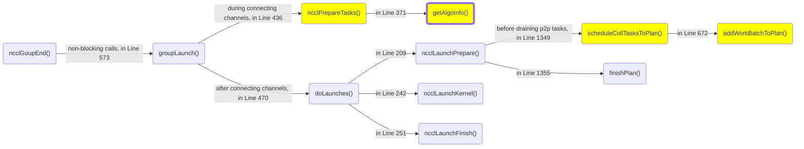

# NCCL Runtime #10: Collective Functions

As mentioned in [09-p2p-functions](09-p2p-functions.md), P2P functions were introduced later than collective functions, and they reused the existing engines. Thus, much of the procedure for executing collective functions is the same as that for P2P functions.

## Preparation

The preparation phase for collective tasks is nearly identical to that of P2P tasks, including the enqueueing of collective tasks and the peeling of tasks into kernel plans. The main difference is that there is an additional selection of the channel-connect algorithm and protocol for each collective task using the [tuning model](08-tuning-model.md).

We illustrate the invocation chain of collective functions after a group call ends. The difference compared to that of P2P functions is highlighted in yellow. Moreover, the [`getAlgoInfo()`](https://github.com/NVIDIA/nccl/blob/v2.25.1-1/src/enqueue.cc#L1721) function, as shown in the bolded box, determines the algorithm and protocol. The time is [estimated](https://github.com/NVIDIA/nccl/blob/v2.25.1-1/src/graph/tuning.cc#L544) as
$$
T_{\mathrm{predicted}}(S)=\frac{S}{\mathrm{bandwidths[func][algo][proto]}}+\mathrm{latencies[func][algo][proto]},
$$
as mentioned in [08-tuning-model](08-tuning-model.md). After computing the estimated time for all combinations, this function will [iterate](https://github.com/NVIDIA/nccl/blob/v2.25.1-1/src/enqueue.cc#L1638-L1647) over them, choosing the minimum one. The corresponding algorithm and protocol are then [written](https://github.com/NVIDIA/nccl/blob/v2.25.1-1/src/enqueue.cc#L1649-L1650) back to the task `struct ncclTaskColl`.

## Runtime

The NCCL kernel launch procedure is also the same. The divergence in the control flow begins after loading the first batch, whose type is [`struct ncclDevWorkColl`](https://github.com/NVIDIA/nccl/blob/master/src/include/device.h#L256) for collective network or [`struct ncclDevWorkCollReg`](https://github.com/NVIDIA/nccl/blob/v2.25.1-1/src/include/device.h#L321) otherwise, because the device function ID differs (i.e., not `ncclDevFunc_SendRecv`).

Different from P2P functions that only have one device function `ncclDevFunc_SendRecv`, Numerous device functions are available for a given collective op. The func ID of a work batch depends on the collective op, reduce op, element type, channel connection algorithm, and protocol. For example, `ncclDevFunc_AllReduce_Sum_bf16_RING_SIMPLE()` declares an AllReduce function that computes the SUM of BF16 data over a ring graph using the SIMPLE protocol. Under the hood, these functions are all defined as a [wrapper](https://github.com/NVIDIA/nccl/blob/v2.25.1-1/src/device/common.h#L402-L405) of `RunWorkBatch<>.run()`. Recall that `RunWorkBatch<> ` is specialized for P2P functions. For collective functions, its template implementation is in [`common.h`](https://github.com/NVIDIA/nccl/blob/v2.25.1-1/src/device/common.h#L277).

**A block will execute all the work items in a work batch sequentially, with synchronization before proceeding to the next work item.** Each work is [done]() by the [`run()`](https://github.com/NVIDIA/nccl/blob/v2.25.1-1/src/device/common.h#L306) method of `RunWorkColl<Fn, T, RedOp, Algo, Proto>`. The template of each combination of `(Fn,Algo,Proto)` is specialized, so `(T,RedOp)` (element type, reduce op) are the "actual" template parameters. For the rest of this note, we [`focus on`](https://github.com/NVIDIA/nccl/blob/v2.25.1-1/src/device/all_reduce.h#L233) AllReduce on the RING graph using the SIMPLE protocol.

### Case Study: AllReduce + RING + SIMPLE

**The workhouse is the [`runRing<>`](https://github.com/NVIDIA/nccl/blob/v2.25.1-1/src/device/all_reduce.h#L13) function.** Similar to P2P functions, the underlying data movement is done via [`Primitives<>`](https://github.com/NVIDIA/nccl/blob/v2.25.1-1/src/device/all_reduce.h#L31). The difference is that while P2P functions only use the `directSend()` and `directRecv()` methods of a primitive, collective functions further use [`directRecvReduceDirectSend()`](https://github.com/NVIDIA/nccl/blob/v2.25.1-1/src/device/all_reduce.h#L55) (we will abbreviate it to `rrs`), [`directRecvReduceCopyDirectSend()`](https://github.com/NVIDIA/nccl/blob/v2.25.1-1/src/device/all_reduce.h#64) (we will abbreviate it to `rrcs`), [`directRecvCopyDirectSend()`](https://github.com/NVIDIA/nccl/blob/v2.25.1-1/src/device/all_reduce.h#L72) (we will abbreviate it to `rcs`). These methods combined multiple operations into a single function to improve execution efficiency.

**Ring AllReduce is executed in $2(W-1)$ stages, where $W$ is the world size.** Stage 0 [sends](https://github.com/NVIDIA/nccl/blob/v2.25.1-1/src/device/all_reduce.h#L47) out data with `directSend()`. The next $W-2$ stages [call](https://github.com/NVIDIA/nccl/blob/v2.25.1-1/src/device/all_reduce.h#L55) `rrs`, which receives the previous GPU's data into the SIMPLE protocol's buffer, reduces it with the local data, and sends it to the next GPU. Then, Stage $(W-1)$ [calls](https://github.com/NVIDIA/nccl/blob/v2.25.1-1/src/device/all_reduce.h#L64) `rrcs`. This additional copy (`c`) is because we have the final all-reduced result at this stage. Eventually, the last $(W-2)$ stages [call](https://github.com/NVIDIA/nccl/blob/v2.25.1-1/src/device/all_reduce.h#L72) `rcs` that receives the result from the previous GPU, copies the result from the SIMPLE protocol's buffer into the destination buffer, and forwards it to the next GPU. No reduce op is needed anymore. There is also a trailing [`directRecv()`](https://github.com/NVIDIA/nccl/blob/v2.25.1-1/src/device/all_reduce.h#L81) so every peer receives the last piece of data.

All the above primitive methods are [implemented](https://github.com/NVIDIA/nccl/blob/v2.25.1-1/src/device/prims_simple.h#L853-L928) by the same `genericOp<>` that we already investigated in the previous note. They only pass different template arguments to `genericOp<>` to dictate the working mode, so we will skip the details.

