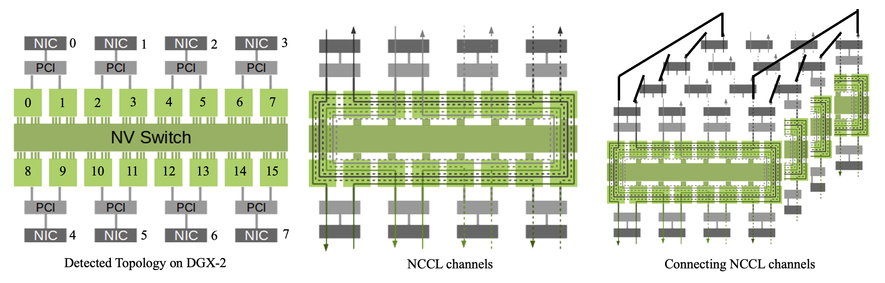

# NCCL Overview

All explanations and linkages to the NCCL source code below are based on the NCCL version [2.25](https://github.com/NVIDIA/nccl/tree/v2.25.1-1).

Organization of this overview:

- [Typical Workflow](#typical-workflow)
- [NCCL Initialization: An Overview](#nccl-initialization-an-overview)
- [NCCL Runtime: An Overview](#nccl-runtime-an-overview)
- [NCCL Initialization: More Words on Channel Search](#nccl-initialization-more-words-on-channel-search)

Please refer to the numbered notes (e.g., [01-unique-id](01-unique-id.md)) for more detailed explanation of the NCCL code.

## Typical Workflow

```c++
// Assume each process handles 1 GPU
int main(int argc, char** argv) {
    int myRank = -1, nRanks = -1;
  	ncclComm_t comm; // NCCL communicator

    MPI_Init(&argc, &argv);
    MPI_Comm_rank(MPI_COMM_WORLD, &myRank);
    MPI_Comm_size(MPI_COMM_WORLD, &nRanks);
    ncclUniqueId ncclID;
    if (myRank == 0) {
        NCCL_CHECK(ncclGetUniqueId(&ncclID));
    }
    MPI_Bcast(&ncclID, sizeof(ncclID), MPI_BYTE, /* root of broadcast */0, MPI_COMM_WORLD);
    // Initialize the communicator
    NCCL_CHECK(ncclCommInitRank(&comm, nRanks, ncclID, myRank));
    // Do something
    // e.g., NCCL_CHECK(ncclAllReduce(d_data, d_recvbuf, count, ncclFloat, ncclSum, this->comm, this->stream));
    // e.g., NCCL_CHECK(ncclSend(d_data + send_chunk * chunk_size, chunk_size, ncclFloat, next, this->comm, stream[SEND]));   
    // Destory NCCL communicator
    NCCL_CHECK(ncclCommDestroy(comm));
    // Finalizing MPI
    MPI_Finalize();
}
```

- Only one process or thread generates an ID using [`ncclGetUniqueId()`](https://docs.nvidia.com/deeplearning/nccl/user-guide/docs/api/comms.html#c.ncclGetUniqueId). Later, all processes and threads will use this ID to synchronize and understand they are part of the same communication group.
  - ID has to be broadcast to all participating threads and processes using any CPU communication system
  - In our case, we need inter-process communication to distribute ID, so a viable option is MPI
  - In [`torch.distributed.init_process_group`](https://pytorch.org/docs/stable/distributed.html#torch.distributed.init_process_group), this is handled by TCPStore, a distributed key-value store that shares information between processes in the group
- Create an NCCL communicator with [`ncclCommInitRank()`](https://docs.nvidia.com/deeplearning/nccl/user-guide/docs/api/comms.html#c.ncclCommInitRank), each associated with a fixed rank and CUDA device
  - [`torch.distributed.init_process_group`](https://pytorch.org/docs/stable/distributed.html#torch.distributed.init_process_group) also calls this function under the hood, given NCCL as its backend
  - Each communicator in a group is associated with a **distinct** GPU and rank. NCCL does not support creating multiple communicators over the same GPU within a communication group
- After that, do whatever communication you like. There are [two kinds](https://docs.nvidia.com/deeplearning/nccl/user-guide/docs/index.html) of communication functions:
  - P2P: `ncclSend()` and `ncclRecv()`
  - Collective communication: `ncclAllReduce()`, `ncclBroadcast()`, `ncclReduce()`, `ncclAllGather()`, and `ncclReduceScatter()`
    - For those unimplemented collectives like All-to-All, you can implement it via a series of P2P communication

- Once all communications are done, free up all resources via `ncclCommDestroy()`

> **Note 1:** [`ncclComm_t`](https://github.com/NVIDIA/nccl/blob/v2.25.1-1/src/nccl.h.in#L33) is just a pointer to [`ncclComm`](https://github.com/NVIDIA/nccl/blob/v2.25.1-1/src/include/comm.h#L404-L614), the NCCL communicator.
>
> **Note 2:** The NCCL communicator is a large struct holding tons of context data (`sizeof(ncclComm)` is 501072!) required by any communication in the group later.
>
> **Note 3:** `NCCL_CHECK` is an error checking macro. Every NCCL function returns with `ncclResult_t`, indicating whether the function succeeds, fails, or is still in progress (for async calls).

**A handy feature of NCCL is [group calls](https://docs.nvidia.com/deeplearning/nccl/user-guide/docs/usage/groups.html).** Its basic semantics is to enclose a group of independent operations (either P2P or collective) between a pair of `ncclGroupStart()` and `ncclGroupEnd()`, and an example is given below. These operations are aggregated, meaning (1) they will be launched as one kernel if possible, and (2) the NCCL operation will only be started as a whole during the last call to `ncclGroupEnd()`. The implications are as follows. (1) Compared to separate calls where each operation can launch one or more CUDA kernels, group calls greatly reduce the kernel launch overhead (we mean latency here), as kernel launch is time-consuming. (2) NCCL does not enforce that one operation is completed before the next starts in a group call, so you cannot put dependent operations in a group call (i.e., `op A` should start only after `op B` finishes).

```c++
ncclGroupStart();
ncclBroadcast(sendbuff1, recvbuff1, count1, datatype, root, comm, stream);
ncclAllReduce(sendbuff2, recvbuff2, count2, datatype, comm, stream);
ncclAllReduce(sendbuff3, recvbuff3, count3, datatype, comm, stream);
ncclGroupEnd();
```

> **Note:** You may wonder what happens if we use multiple streams in an NCCL group. Since, if possible, NCCL will fuse multiple calls into one kernel, shouldn't only one stream execute it? We will mention in [09-p2p-functions](09-p2p-functions.md) that NCCL launches all work to the first stream in a group call. NCCL internally enforces a stream dependency of all involved streams before the NCCL kernel starts and blocks them until the NCCL kernel completes. It will behave as if the NCCL group operation was posted on every stream. You can also see an explanation [here](https://docs.nvidia.com/deeplearning/nccl/user-guide/docs/usage/streams.html#mixing-multiple-streams-within-the-same-ncclgroupstart-end-group).

**NCCL group calls only work for NCCL functions.** You should only put CUDA calls that change the current thread's working context (e.g., `cudaSetDevice()`) in the group calls, as their effect is immediately resolved in subsequent NCCL calls. However, you should not put CUDA calls that involve kernel launch in a group call since they are issued immediately rather than being batched until `ncclGroupEnd()` is called.

## NCCL Initialization: An Overview

> **Note:** We explain the details of NCCL initialization in the following notes.
>
> - [01-unique-id](01-unique-id.md)
>
> - [02-bootstrap-network](02-bootstrap-network.md)
>
> - [03-XML-conversion](03-XML-conversion.md)
>
> - [04-path-finding](04-path-finding)
>
> - [05-channel-search](05-channel-search.md)
>
> - [06-channel-connect](06-channel-connect.md)
>
> - [07-transport-setup](07-transport-setup.md)
>
> - [08-tuning-model](08-tuning-model.md)

Communicator initialization is done by two functions sequentially: `ncclGetUniqueId()` and `ncclCommInitRank()`.

- `ncclGetUniqueId()`

  - **Initializes** two networks **on the root** (i.e., the calling process): one for **bootstrap** and one for **data communication**. The bootstrap network (using TCP, also called the out-of-band (OOB) connection) exchanges small control messages when creating an NCCL communicator. The data communication network transmits data messages. It can be a network plugin (e.g., CollNet (collective network), which does in-network All-Reduce on InfiniBand switches), RDMA network (using GDR (GPU-Direct RDMA) if available), or the traditional socket network.

  - The generated ID (defined as `struct {char [128];}`) is just an address of a listen socket `<ip>:<port>` in the bootstrap network that other ranks can later connect to.

    ```mermaid
    ---
    title: Bootstrap network (Initialization)
    ---
    flowchart TD
      subgraph "rank 0"
        ID(sk:ID)
      end
      
      subgraph "rank 1"
      end
      
      subgraph "rank 2"
      end
      
      subgraph "rank 3"
      end
    ```

  - Its implementation is simple and easy to understand.

- `ncclCommInitRank()`, invoked by all ranks, establishes a fully functional bootstrap network and data communication network in numerous steps.

  - **Building a connected bootstrap network** (in [`bootstrapInit()`](https://github.com/NVIDIA/nccl/blob/v2.25.1-1/src/bootstrap.cc#L619)): Each rank has its peer info (e.g., my local machine's channel) to share with others via the bootstrap network, so the first thing it does is to build a connected bootstrap network that includes all the ranks. Upon establishment, this bootstrap network is recorded in each communicator's `comm->bootstrap`.

    - In the bootstrap network, every rank knows the bootstrap address to talk to another rank.

    - NCCL builds the bootstrap network in three steps.

      1. Every rank opens two sockets: one for the root to connect (`skR` in the figure below) and one for the previous rank to connect (`skB` in the figure below). The former is short-lived, while the latter is long-lived. The only thing `skR` does is send the address of `skB` to root and receive the address of the next peer's `skB`. After that, `skR` is closed.

         ```mermaid
         ---
         title: Bootstrap network (in construction, Step 1)
         ---
         flowchart TD
           subgraph "rank 0"
             ID(sk:ID)
             skR0--Addr(skB0)-->ID
           	ID--Addr(skB1)-->skR0
           	skB0
           end
           
           subgraph "rank 1"
           	skR1--Addr(skB1)-->ID
           	ID--Addr(skB2)-->skR1
           	skB1
           end
           
           subgraph "rank 2"
             skR2--Address(skB2)-->ID
           	ID--Address(skB3)-->skR2
           	skB2
           end
           
           subgraph "rank 3"
             skR3--Address(skB3)-->ID
             ID--Address(skB0)-->skR3
           	skB3
           end
         ```

      2. Every rank connects to the next peer's `skB` and accepts the previous peer's connection. Now, the ring bootstrap network is built. However, every rank only knows its next rank's bootstrap address.

         ```mermaid
         ---
         title: Bootstrap network (in construction, Step 2)
         ---
         flowchart TD
           subgraph "rank 0"
             skB0
           end
           subgraph "rank 1"
             skB1
           end
           subgraph "rank 2"
             skB2
           end
           subgraph "rank 3"
             skB3
           end
           skB0-->skB1
           skB1-->skB2
           skB2-->skB3
           skB3-->skB0
         ```

      3. Every peer uses a ring All-Gather in $(W-1)$ steps on this ring-structured bootstrap network to collect `skB`'s address. We emphasize that the bootstrap network only transmits lightweight control messages, so optimizing its layout is of little value.

  - **Detecting and building transport channels over the data communication network** (in [`initTransportsRank()`](https://github.com/NVIDIA/nccl/blob/v2.25.1-1/src/init.cc#L659)): NCCL spends considerable effort choosing transport channels. Constructing such channels has two phases: building intra-node channels (i.e., data paths within a machine) and inter-node connections (i.e., data paths between two machines). **For intra-node channels,** NCCL will (1) contact the machine's OS for hardware topology, including CPU, GPU, NIC, PCI Bus, PCI Switch, NVLink, NVSwitch, etc.; (2) estimate the highest bandwidth and the corresponding path between any two hardware components (e.g., GPU-to-GPU, GPU-to-NIC); (3) arrange local GPUs in certain orders (i.e., NCCL channels) that maximize the bandwidth to transmit data among local GPUs; (4) attach the nearest NIC to each channel so that the first GPU handles the reception of data from other machines, and the last GPU handles the transmit of data to other machines. **For inter-node connections,** NCCL will try to connect intra-node channels from different machines and establish the required transport channel in the data communication network. For example, if machines are connected by RDMA (either IB/RoCE) networks, it will try to build an RDMA RC (reliable connection) between every two connected intra-node channels. Let's illustrate this with the following DGX-2 example.

    

    > **Example:** Suppose the current communication group includes 4 DGX-2 machines and 16*4=64 GPUs and the inter-node network uses RDMA.
    >
    > The leftmost figure gives the intra-node hardware topology of one node. `ncclCommInitRank()` first detects the local machine's hardware topology by consulting OS (e.g., on a Linux machine, this corresponds to reading hardware config under `/sys` ). Each rank knows the 16 GPUs, 8 PCI switches, and 8 NICs locally. They also know the interconnections between these components, including NVLinks, PCI buses, and system buses (i.e., CPU-to-CPU links like QPIs, not shown in the figure). For example, each rank knows that the local PCI switch 0 connects NIC 0 to GPU 0 and 1. For each interconnection, it not only knows its two ends but also its attributes (e.g., bandwidth, model, bus ID) by consulting OS. OS knows these attributes during hardware booting (e.g., in BIOS). On a Linux system, each attribute is exposed to userspace via a readable file under `/sys`.
    >
    > Once the local machine's topology is detected, NCCL constructs channels within each machine. An NCCL channel is a logical term (not physical wires) dictating the flow of data within a machine, which includes all local GPUs and an ingress and egress NIC. In the middle figure, one channel is `NIC 0-->GPU 0-->GPU 8-->GPU 9-->GPU 10-->GPU 11-->GPU 12-->GPU 13-->GPU 14-->GPU 15-->GPU 7-->GPU 6-->GPU 5-->GPU 4-->GPU 3-->GPU 2-->GPU 1-->NIC 0`. Multiple channels can be found on each machine. They transmit data in parallel. Different channels are executed by different blocks in the CUDA kernel launched by each GPU, so combined, they can efficiently utilize the hardware bandwidth. Suppose each arrow in the middle figure represents one channel (there can be multiple channels using the same paths, so an arrow in the figure may represent two or more channels, but we assume one for now); then, there are eight channels per machine. Each channel handles just 1/8 of the whole job.
    >
    > After searching for local channels on each machine, NCCL connects channels on different machines. For example, in the rightmost figure, all channels starting and ending with NIC 0 are connected. NCCL supports multiple algorithms (NCCL_ALGO) to connect these channels, such as RING, TREE, and COLLNET. The figure shows the RING algorithm. This way, every rank knows the ranks to send and receive data from in each channel.

    > **Note:** An NCCL channel is an intra-node concept. Each channel can only be a ring (i.e., `GPU a-->GPU b-->...-->GPU x-->GPU a`) or chain (i.e., `GPU a-->GPU b-->...-->GPU x`). It cannot branch. For example, GPUs in a channel cannot be ordered as `...<--GPU 8<--GPU 0-->GPU 1-->...`. One reason is that it facilitates the inter-node channel connection.
    >
    > **Note:** `NCCL_ALGO` mostly affects how channels are connected between different machines. They have little to do with the channel search within each machine, which is driven by the local machine's hardware topology.

    How does NCCL build the computed channels and connections between channels? We need to discuss based on the types of paths between two hardware components:

    1. If two GPUs are in the same NVLink domain or on the same PCIe root complex that supports CUDA peer access, a p2p (Peer-to-Peer) transport builds this connection. NCCL does this via CUDA [Peer Device Memory Access](https://docs.nvidia.com/cuda/cuda-runtime-api/group__CUDART__PEER.html) APIs.
    2. If two GPUs are only connected by a generic system bus, NCCL falls back on a shm (shared memory) transport for this connection, which involves the CPU and the host memory.
    3. If two GPUs are on different machines, then a net (network) transport builds this connection. The concrete net depends on the network hardware (e.g., CollNet, RDMA, or socket).

    In any case, NCCL builds these connections **per channel.** For example, if an arrow in the above figure represents four channels, NCCL establishes 4 RDMA RC (Reliable Connection) QPs (Queue Pair) between Node 0's NIC 0 and Node 1's NIC 0, 4 between Node 0's NIC 1 and Node 1's NIC 1, etc.

  - **Spawns a proxy thread per rank** (in [`initTransportsRank()`](https://github.com/NVIDIA/nccl/blob/v2.25.1-1/src/init.cc#L659)): Moving data across the network is trickier than locally. We only focus on the RDMA network. When an RDMA connection is built, each side (pre-)registers an MR (Memory Region) that the NIC can directly read from and write to. This MR is a buffer on GPU (if GDR (GPU-Direct RDMA) is supported) or pinned in the host memory (otherwise), which is not where the actual GPU data reside. Thus, RDMA cannot recognize the data in a collective/P2P operation.

    Proxy thread solves this problem by moving data from the user buffer (`sendbuff`) to MR on the sender side (`buf`) and from MR (`buf`) to the user buffer (`recvbuff`) on the receiver side. This thread works passively, only checking if there is work to do and doing it on demand.

    ```mermaid
    ---
    title: Moving data across the network over GDR-enabled GPUs and NICs
    ---
    flowchart LR
      subgraph "Node 0"
      subgraph "Sender GPU"
        subgraph "MR(sender)"
          bs(buf)
        end
        sb(sendbuff)--CUDA kernel-->bs
      end
      end
      bs--Proxy thread (using RDMA verbs)-->br
      subgraph "Node 1"
      subgraph "Receiver GPU"
        subgraph "MR(reciver)"
          br(buf)
        end
        br--CUDA kernel-->rb(recvbuff)
      end
      end
      
    ```

    

**[`initTransportsRank()`](https://github.com/NVIDIA/nccl/blob/v2.25.1-1/src/init.cc#L659) uses the bootstrap network to perform two (global) All-Gather.**

- The [first All-Gather](https://github.com/NVIDIA/nccl/blob/v2.25.1-1/src/init.cc#L707) exchanges `comm->peerInfo`, which originally holds one peer's information, so everyone knows the host machine and GPU a peer is using. At this point, NCCL also ensures each peer uses a distinct GPU since allowing multiple peers in a communication group to share a device can cause deadlock. Nevertheless, it is fine if two communicators in different communication groups share the same GPU.
- The [second All-Gather](https://github.com/NVIDIA/nccl/blob/v2.25.1-1/src/init.cc#L913) exchanges `comm->graphs`, which originally hold the local channels computed by each peer. Each peer computes several graphs, each serving a particular inter-node connection algorithm (e.g., RING/TREE). By exchanging this information, everyone knows the channels in the corresponding graphs on all other nodes, so they know how to build the entire data path.

During NCCL initialization, there are several global and intra-node barriers to ensure everyone works in lockstep. These barriers can be either explicit (e.g., [`bootstrapIntraNodeBarrier()`](https://github.com/NVIDIA/nccl/blob/v2.25.1-1/src/bootstrap.cc#L1075)) or implicit (e.g., [`bootstrapAllGather()`](https://github.com/NVIDIA/nccl/blob/v2.25.1-1/src/bootstrap.cc#L1035)). 

Finally, we emphasize some characteristics of NCCL.

1. **There is no consensus problem in NCCL since every peer uses the same deterministic algorithm on the same data.** They automatically agree on the computed information. For example, if Node 0's local rank 1 thinks that its next peer in the ring is Node 1's local rank 0, then Node 1's local rank 0 will also think its previous peer in the ring is Node 0's local rank 1. Since algorithms may change between different NCCL versions, NCCL ensures everyone uses the same version (checked after the first All-Gather in `initTransportsRank()`).
2. **NCCL does not detect the inter-node network topology.** While the intra-node channel search algorithm is complex, the inter-node channel connection algorithm is rather simple and naive, as we will see. Its knowledge of the global topology is limited to knowing the NICs on each involved machine. It does not care about the network fabric between these nodes. It typically sets up the network channels—such as forming RDMA RC QPs or CollNet connections—without inter-node path optimizations.
3. **Many features were added to NCCL recently, making the code somewhat messy and even ad hoc in many places (CAUTION: Personal opinions. Please take it with a pinch of salt).** Recent development includes the support of CollNet (collective network), which allows multiple nodes to do in-network reductions (also called SHARP); NVLS (NVLink SHARP), which refers to the ability of All-Reduce at NVSwitch (Don't confuse it with (in-network) SHARP, which is done on IB switches), and MNNVL (Multi-node NVLink), which enables NVLink communication between processes located on different nodes (e.g., [Nvidia GB300 NVL72](https://www.nvidia.com/en-us/data-center/gb300-nvl72/?ncid=no-ncid)). These techniques deeply affect channel search, cross-node connection, and data communication.

## NCCL Runtime: An Overview

**NCCL maintains a P2P task queue and a collective task queue inside [`comm->planner`](https://github.com/NVIDIA/nccl/blob/v2.25.1-1/src/include/comm.h#L572) to trace the work inside a group call.** You can think of a non-group call as a group call containing only one communication function. Each NCCL communication function enqueues a task to the corresponding queue, which records all the necessary information that describes the task. Then, execution occurs asynchronously when a group call ends. NCCL fetches all the queued tasks, Codistributes them to every channel, prepares kernel launch configuration and per-channel task description, and finally launches kernel. Typically, one block in the kernel launch handles one channel's task, and every block operates on the corresponding channel's task description. Thus, different blocks can have different working behaviors, and they are running in parallel.

**NCCL supports three protocols: SIMPLE, LL, and LL128, where LL stands for low latency.** SIMPLE is suitable for transferring large messages, where the  factor (bandwidth factor) dominates. LL and LL128 are suitable for transferring small messages, where the  factor (link latency) dominates. We provide a brief description of these protocols below. If you are not interested, feel free to skip it.

1. The SIMPLE protocol is the conventional way of data transmission. Every message delivery needs at least one memory barrier (or fence). This is because after writing the data into memory, the sender must signal that the data is ready for consumption. This signaling is typically done by writing a flag into memory. However, due to the nature of modern memory systems and processor out-of-order execution, the write of the data and the write of the flag could be reordered by either the compiler or the hardware. Without any ordering guarantee, the receiver might see the flag change before all the data has been committed to memory, leading to race conditions. Therefore, the memory barrier ensures that all write operations are completed and made globally visible before the flag is written. This ordering is critical for the correctness of the SIMPLE protocol.
2. LL protocol is designed to include the flag with the data in a single operation (often through atomic operations or specialized hardware instructions). As a result, the receiver can immediately deduce that if the flag is seen, the data is already valid, and no extra barrier is necessary. However, it trades bandwidth for latency since, in LL, we send a 32-bit flag for every 32-bit payload (so LL relies on 8-byte atmoic operations). The effective bandwidth is halved, but memory barriers are avoided, which makes it suitable only for small messages.
3. LL128 is based on the same principle as LL but improves by enabling a 64-bit flag for every 960-bit payload. It relies on 128-byte atomic operations. The effective bandwidth is raised to $960/(960+64)\approx 95\%$ of the hardware bandwidth, and the latency is further reduced for small messages compared to LL.

**Let us first look at P2P functions first.** Based on the location of the send and receive buffer (`sendbuff`/ `recvbuff`), `ncclSend()`/`ncclRecv()` launches different kernels and has different processing procedures. There are 3 cases: (1) two GPUs are the same; (2) two GPUs are on the same node and have peer access; (3) two GPUs are on the same node and do not have peer access; (4) two GPUs are on different nodes.

1. For Case 1, It launches a copy kernel. To improve the access pattern, it divides `sendbuff` and `recvbuff` into two parts: byte aligned (a multiple of warp size) and not.
2. For Case 2, the sender launches a copy kernel that moves the data from `sendbuff` to the p2p transport buffer `buf`. The receiver launches a copy kernel that moves the data from the p2p transport buff to `recvbuff`. This `buf` is the counterpart to the MR in the RDMA net transport but is organized as a lock-free FIFO queue. Each side maintains and exchanges its head and tail pointers to coordinate send and receive.
3. For Case 3, the sender launches a copy kernel that moves the data from `sendbuff` to the host's shared memory. The receiver launches a copy kernel that moves the data from the shared memory to `recvbuff`. Currently, I haven't investigated its synchronization mechanism. Note that Cases 2 and 3 are both handled by the [CUDA IPC](https://docs.nvidia.com/cuda/cuda-c-programming-guide/#interprocess-communication) (inter-process communication) framework (if the two local GPUs are managed by different processes).
4. Case 4 involves kernels and proxy threads. The kernel and proxy thread on the same side pass data using a producer-consumer queue. The two proxy threads communicate using the two-sided RDMA send/recv verbs. We provide details later in the corresponding chapter.

**NCCL processes an arbitrarily large user buffer in several loops, each handling  of data.** This is because a kernel launch has   blocks and a channel handles one block in a loop. The number of loops required is therefore , and this is the outer for loop in the kernel. Each block internally divides a chunk into several **slices**, the finest granularity of data communication and synchronization.

1. In the SIMPLE protocol, each channel has one CUDA warp that acts as a sync warp. After the other worker warps finish writing a slice, the sender‑side sync warp executes `__threadfence_system()` and advances the FIFO queue’s tail counter (also called the **flag**, since it indicates incoming data), allowing the peer to start reading.  The receiver‑side sync warp waits for that tail value, lets its workers read the slice, and then advances the head counter so the sender knows the slot has been consumed. This way, NCCL implements a lock-free producer/consumer queue.
2. In the LL and LL128 protocols, each slice is transmitted as a series of fixed‑size lines—8 bytes in LL and 128 bytes in LL128. The ready flag is written along with the payload in the same atomic store so the receiver can simply poll the flag. Once it changes, the corresponding data are already visible. No memory fence is needed.

**The P2P primitives, which appeared since NCCL 2.7, were implemented by re‑using the same internal engine—channels, chunks, slices, and FIFO flags—that had already powered the collective kernels.** We only mention some major differences compared to P2P functions: (1) Each algorithm (`NCCL_ALGO`) has its own CUDA kernel (e.g., AllReduce Ring, AllReduce Tree). (2) The looping structure of the collective kernels is more complex than the P2P kernel because several stages are needed to process a piece of data.

## NCCL Initialization: More Words on Channel Search

> **Note:** We explain the details of NCCL runtime in the following notes.
>
> - [09-p2p-functions](09-p2p-functions.md)
>
> - [10-collective-functions](10-collective-functions.md)
>

Previously, we omitted many intermediate steps in how [`initTransportsRank()`](https://github.com/NVIDIA/nccl/blob/v2.25.1-1/src/init.cc#L659) detects and builds transport channels over the data communication network. It has the following steps:

1. On a Linux machine, it first consults `/sys` to obtain the local machine's topology, which it stores as an XML tree. The following is a pictorial view. NCCL skips topology detection and loads the XML tree if it is already on the current system ( by `NCCL_TOPO_FILE`).

   ```mermaid
   flowchart LR
   	system-->cpu(cpu,numaid=1)
   	cpu-->pci(pci,busid=0000:99:00.0)
   	cpu-->pci1(pci,busid=0000:bd:00.0)
   	pci-->gpu(gpu,dev=0,gdr=1)
   	pci1-->gpu1(gpu,dev=1,dgr=1)
   	gpu-->nvlink(nvlink,target=0000:bd:00.0,count=4)
   	gpu1-->nvlink1(nvlink,target=0000:99:00.0,count=4)
   	system-->cpu0(cpu,numaid=0)
   	cpu0-->nic(nic,name=mlx5_0+mlx5_1,dev=2,gdr=1)
   ```

2. Since the XML tree is not friendly to channel search, it is first transformed into a topology graph. The following is a pictorial view. Each edge in the graph corresponds to one direction of a physical wire. Since intra-node connections are typically bi-directional, edges usually come in pairs. Moreover, it knows different **link types** and their attributes (like bandwidth and latency). This knowledge comes from `/sys`, where an attribute is exposed as a regular file in `/sys` during system booting. NCCL does not profile the link bandwidth.

   ```mermaid
   flowchart-elk LR
   	subgraph GPU
     	GPU0[GPU,dev:0]
     	GPU1[GPU,dev:1]
     end
     subgraph CPU
     	CPU0[CPU0]
     	CPU1[CPU1]
     end
     NIC[NIC]
     NET[NET]
     GPU0--NVL,bw:48.0-->GPU1
     GPU0--PCI,bw:24.0-->CPU1
     GPU1--NVL,bw:48:0-->GPU0
     GPU1--PCI,bw:24.0-->CPU1
     CPU1--PCI,bw:24.0-->GPU0
     CPU1--PCI,bw:24.0-->GPU1
     CPU1--SYS,bw:10.0-->CPU0
     CPU0--PCI,bw:5000.0-->NIC
     CPU0--SYS,bw:10.0-->CPU1
     NIC--NET,bw:25.0-->NET
     NIC--PCI,bw:5000.0-->CPU0
     NET--NET,bw:25.0-->NIC
   ```

3. Once the links are known, NCCL searches for the best path between any two vertices in the topology graph. This path should (1) use high-priority links and (2) maximize the minimal bandwidth between the links on the paths. The priority of links is NVLink > PCI bus > System bus (i.e., CPU-to-CPU bus, like QPI) > Network. Since a path may contain multiple links, NCCL assigns each path a **path type**. There are ten path types. Similar to link type, they describe the overall quality of a path. We emphasize that a path is just a logical abstraction, helping NCCL search for channels that efficiently utilize the hardware bandwidth. When two vertices communicate, it does not issue send/receive requests hop-by-hop on each intermediate vertex in the path. It just checks path types and decides which interfaces to use, e.g., peer-to-peer (like two directly connected GPUs), shared-memory (like two GPUs in different NUMA domains), RDMA verbs (like two GPUs on different machines).

4. Once NCCL knows the best paths between any two vertices in the local machine's intra-node topology. NCCL bundles several paths in a chain fashion to form a channel. NCCL tries to discover as many channels as possible, maximizing their combined bandwidth. At runtime, each channel will be used by an SM on each involved GPU, so multiple channels will transmit data in parallel. Note that an NCCL channel is not a physical wire but a logical term (like an abstraction of multiple physical wires in a certain order). One straightforward constraint in channel search is that for each link, \leq\mathrm{Bw}(\mathrm{link})), i.e., the sum of the bandwidth of channels that pass through a link cannot exceed the link's bandwidth.

   > **Note:** Don't confuse the concepts of a link, path, and channel. One or more chained links constitute a path, and one or more chained paths constitute a channel. A link corresponds to a physical wire that delivers the actual traffic. A path connects two nodes in the topology graph in a way that maximizes node-to-node bandwidth. A channel connects all relevant nodes in a certain order.

5. It finally connects channels on different machines.

Finally, we briefly mention the algorithm NCCL uses to accomplish each step.

1. A recursive algorithm
2. A recursive algorithm
3. An [SPFA](https://oi-wiki.org/graph/shortest-path/#bellmanford-%E7%AE%97%E6%B3%95) search (or you can think it as a BFS search)
4. A DFS-based brute-force search
5. We must address two questions: (1) Which remote channels should a local channel connect to? (2) If I know all the remotes to connect to, how to connect their ends? The answer is as follows. (1) NCCL relies on the order of channels searched by each rank. It tries to connect channels having the same index on each machine. For example, channel 0 on node 0 will try to connect with channel 0 on other machines. Though counterexamples exist, this largely matches the real NCCL behavior. (2) It uses the algorithm specified by `NCCL_ALGO` to connect multiple channels. If `NCCL_ALGO` is unspecified, it tries all possible inter-node connection algorithms and uses a **numerical tuning model** to decide which algorithm (e.g., RING/TREE) and protocol (i.e., SIMPLE/LL/LL128) achieves the lowest job completion time (i.e., who finishes first). By saying "numerical", we emphasize that it estimates the time based on some mathematical formulae and does not profile the performance using real traffic.
